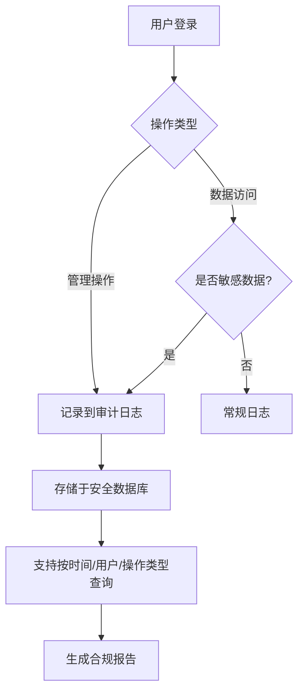

# 企业级组织管理模块

<cite>
**本文档引用文件**
- [ScenarioSection.vue](file://components/landing/ScenarioSection.vue)
- [demo.md](file://content/docs/introduction/demo.md)
- [2503.md](file://content/update/2503.md)
- [ProductFeatures.vue](file://components/landing/ProductFeatures.vue)
- [智言万象.vue](file://pages/智言万象.vue)
- [about.vue](file://pages/about.vue)
</cite>

## 目录
1. [引言](#引言)
2. [权限模型设计](#权限模型设计)
   - [角色分级](#角色分级)
   - [部门隔离策略](#部门隔离策略)
   - [权限继承机制](#权限继承机制)
3. [组织架构配置方法](#组织架构配置方法)
4. [审计日志功能](#审计日志功能)
5. [行业落地实践与配置示例](#行业落地实践与配置示例)
6. [总结](#总结)

## 引言

智言AI平台的企业级组织管理模块旨在满足企业在智能化转型过程中对安全、可控和高效协作的迫切需求。该模块通过灵活的角色权限配置、多层级部门划分以及精细化的数据隔离策略，帮助企业实现资源的有序管理和团队的高效协同。结合RBAC（基于角色的访问控制）权限控制系统，平台不仅支持细粒度的资源访问策略，还确保了关键操作的可追溯性，满足合规要求。本文将系统阐述该模块的核心设计与功能实现，并提供教育、电商、金融等行业的落地实践案例。

**Section sources**
- [ScenarioSection.vue](file://components/landing/ScenarioSection.vue#L60-L64)
- [about.vue](file://pages/about.vue#L81-L84)

## 权限模型设计

企业级组织管理模块的核心是其强大的权限模型设计，该模型基于RBAC原则，确保了权限分配的灵活性与安全性。

### 角色分级

平台定义了清晰的角色分级体系，以适应不同岗位员工的职责需求。主要角色包括：
- **管理员**：拥有组织内所有资源的完全控制权，可进行用户管理、权限分配、系统配置等全局性操作。
- **编辑**：在被授权的部门或项目中，拥有内容的创建、修改和删除权限，但无法更改组织架构或分配权限。
- **只读**：仅能查看和检索信息，适用于需要了解项目进展但无需参与编辑的成员，如审计人员或顾问。

这种分级机制确保了权限的最小化分配，有效降低了误操作和数据泄露的风险。

**Section sources**
- [ScenarioSection.vue](file://components/landing/ScenarioSection.vue#L62)
- [2503.md](file://content/update/2503.md#L2-L3)

### 部门隔离策略

为了保障数据安全和业务独立性，平台实施了严格的部门隔离策略。每个部门被视为一个独立的资源域，其内部的数据和应用默认对其他部门不可见。跨部门访问必须经过明确的权限授予。例如，市场部的工作流和知识库不会被财务部的成员看到，除非管理员显式地授予访问权限。这一策略有效防止了敏感信息的越权访问，满足了企业内部数据保密的要求。

**Section sources**
- [ScenarioSection.vue](file://components/landing/ScenarioSection.vue#L62)
- [智言万象.vue](file://pages/智言万象.vue#L776)

### 权限继承机制

权限继承机制简化了大型组织的管理复杂度。在组织架构中，子部门会自动继承父部门的权限设置。例如，如果“华东大区”被授予了某个应用的编辑权限，那么其下属的“上海分公司”和“杭州分公司”也将自动获得该权限。管理员可以在继承的基础上进行微调，为子部门添加或移除特定权限，从而在保证一致性的同时兼顾灵活性。

**Section sources**
- [智言万象.vue](file://pages/智言万象.vue#L776)

## 组织架构配置方法

平台支持灵活的多层级部门划分和成员管理，以匹配企业真实的组织结构。

### 多层级部门划分

管理员可以通过直观的界面创建无限层级的部门结构，如“集团 > 事业部 > 分公司 > 部门 > 小组”。这种树状结构清晰地反映了企业的汇报关系和业务单元划分。每个部门节点都可以独立配置其权限、成员和资源，实现了组织管理的模块化。

### 成员管理

成员管理功能允许管理员将用户添加到一个或多个部门中，并为其分配相应的角色。用户登录后，其视图和操作权限会根据所在部门和角色动态调整。此外，平台支持批量导入和导出成员信息，便于与企业现有的HR系统进行集成，提高管理效率。

**Section sources**
- [ScenarioSection.vue](file://components/landing/ScenarioSection.vue#L62)
- [ProductFeatures.vue](file://components/landing/ProductFeatures.vue#L149)

## 审计日志功能

审计日志功能是确保平台合规性和安全性的关键组件。

### 关键操作记录

根据`demo.md`文件中提供的管理员账号信息（超级管理员账号：admin），可以验证审计日志的访问权限。平台会自动记录所有关键操作，包括但不限于：
- 用户的创建、删除和权限变更
- 敏感数据的访问和修改
- 系统配置的调整
- 应用的发布和部署

### 满足合规要求

这些日志详细记录了操作时间、操作人、操作对象和操作结果，为事后追溯和责任认定提供了坚实依据。例如，在金融行业中，审计日志能够证明客户数据的处理过程符合监管要求。用户评价中提到的“多级权限审计”和“审计合规率100%”也印证了该功能在实际应用中的重要价值。

**Diagram sources**
- [demo.md](file://content/docs/introduction/demo.md#L18-L20)
- [智言万象.vue](file://pages/智言万象.vue#L1060)

## 行业落地实践与配置示例

企业级组织管理模块已在多个行业成功落地，以下是几个典型实践案例。

### 教育行业

在教育机构中，可以按“学院 > 系 > 教研室”建立组织架构。教务处作为管理员，负责全局管理；各系主任作为编辑，管理本系的教学资源；而学生则以只读角色访问课程资料。部门隔离确保了不同专业的教学计划互不干扰。

### 电商行业

电商平台可按“业务线 > 运营团队 > 地域”划分。市场部和运营部作为不同部门，各自管理其营销活动和商品信息。权限继承机制确保了“全国运营”部门的策略能自动下达到各“区域运营”部门，同时允许区域团队进行本地化调整。

### 金融行业

金融机构对安全要求极高。可建立“总行 > 分行 > 部门”的架构，并实施严格的部门隔离。风控部门拥有对所有交易数据的只读权限用于监控，而交易部门只能访问其负责的产品线。审计日志完整记录所有操作，满足金监局的合规审查要求，正如用户评价所述“审计合规率100%”。

**Section sources**
- [智言万象.vue](file://pages/智言万象.vue#L1076)
- [about.vue](file://pages/about.vue#L198-L200)

## 总结

智言AI平台的企业级组织管理模块通过先进的RBAC权限模型、灵活的组织架构配置和完备的审计日志功能，为企业提供了一个安全、可控且高效的协作环境。它不仅解决了多部门、多角色下的权限管理难题，还通过部门隔离和权限继承机制，实现了精细化管控与管理效率的平衡。结合各行业的具体需求，该模块能够快速配置并落地，助力企业实现智能化升级和合规运营。
