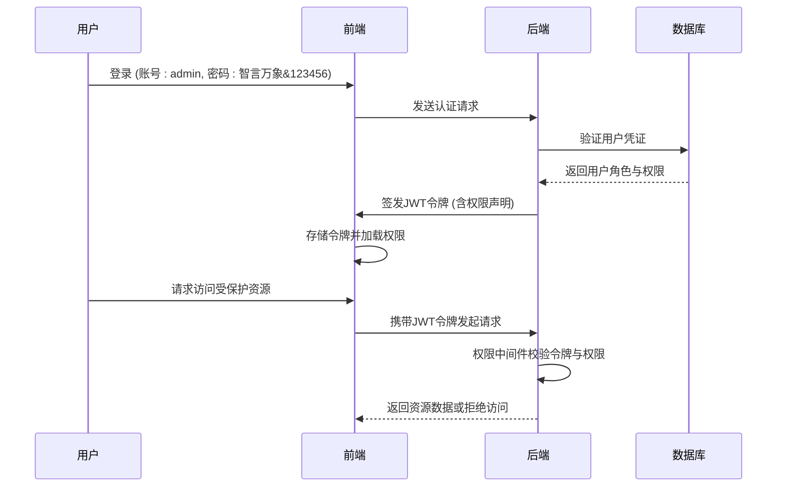
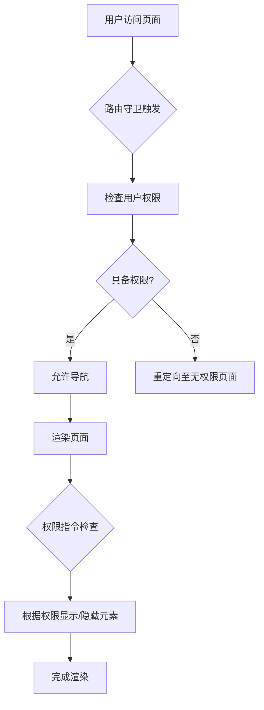

# 权限模型设计

<cite>
**本文档引用的文件**
- [ScenarioSection.vue](file://components/landing/ScenarioSection.vue)
- [demo.md](file://content/docs/introduction/demo.md)
- [2503.md](file://content/update/2503.md)
- [智言万象.vue](file://pages/智言万象.vue)
</cite>

## 目录
1. [引言](#引言)
2. [角色分级体系](#角色分级体系)
3. [数据隔离技术方案](#数据隔离技术方案)
4. [权限继承与覆盖规则](#权限继承与覆盖规则)
5. [权限校验流程与安全控制策略](#权限校验流程与安全控制策略)
6. [RBAC模型在前端的应用](#rbac模型在前端的应用)
7. [结论](#结论)

## 引言
智言万象平台通过企业级组织管理模块实现了精细化的权限控制系统，支持多部门协作与数据隔离。该系统基于RBAC（基于角色的访问控制）模型，结合前端组件与后端策略，确保企业用户在复杂组织架构下的安全与高效协作。本文将详细阐述其权限模型设计。

**Section sources**
- [ScenarioSection.vue](file://components/landing/ScenarioSection.vue#L60-L64)

## 角色分级体系
智言万象平台定义了多层次的角色体系，包括超级管理员、管理员、编辑和只读成员。超级管理员拥有全系统控制权限，可配置组织架构与权限策略；管理员负责部门内资源管理；编辑具备内容创建与修改权限；只读成员仅能查看数据。该分级机制通过角色绑定权限的方式实现，确保职责分离与最小权限原则。

**Section sources**
- [demo.md](file://content/docs/introduction/demo.md#L18-L20)
- [2503.md](file://content/update/2503.md#L1-L15)

## 数据隔离技术方案
平台通过部门级数据隔离机制实现多租户环境下的信息安全。每个部门的数据在存储层通过部门ID进行逻辑分区，访问时需验证用户所属部门与目标资源的归属关系。此外，系统在查询层面引入自动化的WHERE条件注入，确保跨部门数据无法被非法访问，从而实现高效且安全的数据隔离。

**Section sources**
- [ScenarioSection.vue](file://components/landing/ScenarioSection.vue#L62-L63)

## 权限继承与覆盖规则
权限系统支持继承与覆盖机制。子部门默认继承父部门的权限配置，确保组织策略的一致性。同时，管理员可在子部门级别进行权限覆盖，以满足特定业务需求。此机制通过权限树结构实现，每个节点维护自身的权限策略，并在访问检查时自底向上进行权限合并与冲突解决。

**Section sources**
- [2503.md](file://content/update/2503.md#L1-L15)

## 权限校验流程与安全控制策略
权限校验流程始于用户登录，系统根据用户角色加载对应的权限集并缓存于会话中。每次请求到达时，后端通过中间件进行权限验证，检查用户是否具备访问目标资源的权限。超级管理员账号（如demo环境中的admin）拥有最高权限，可绕过常规校验，但其操作会被完整审计。系统还引入JWT令牌机制，确保权限信息的安全传输与防篡改。

**Diagram sources**
- [demo.md](file://content/docs/introduction/demo.md#L18-L20)
- [2503.md](file://content/update/2503.md#L1-L15)

**Section sources**
- [demo.md](file://content/docs/introduction/demo.md#L18-L20)
- [2503.md](file://content/update/2503.md#L1-L15)

## RBAC模型在前端的应用
RBAC模型在前端通过权限指令与路由守卫实现。权限指令（如v-permission）用于控制UI元素的显示与交互，确保用户只能看到其有权访问的功能。路由守卫在导航前拦截请求，验证用户是否具备访问目标页面的权限，防止未授权访问。这些机制与后端权限校验形成双重保障，提升系统安全性。

**Diagram sources**
- [智言万象.vue](file://pages/智言万象.vue#L775-L777)

**Section sources**
- [智言万象.vue](file://pages/智言万象.vue#L775-L777)

## 结论
智言万象平台的权限模型设计充分考虑了企业级应用的安全性与灵活性。通过RBAC模型、数据隔离、权限继承与前端控制的有机结合，实现了细粒度的资源访问控制。该设计不仅满足了复杂组织架构下的协作需求，也为数据安全提供了坚实保障。
