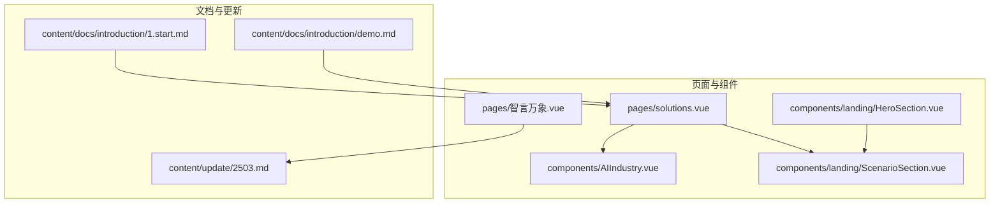
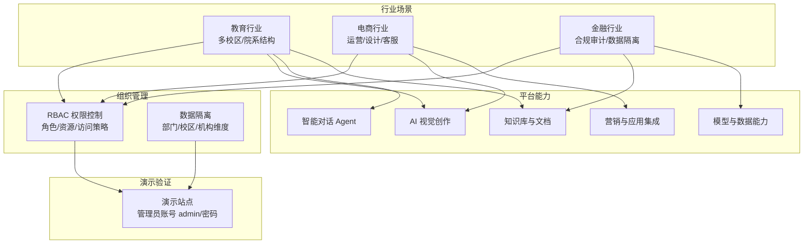
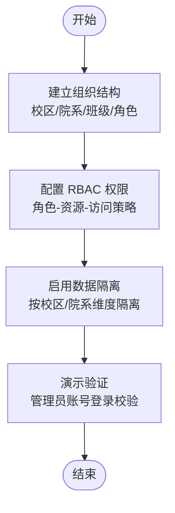
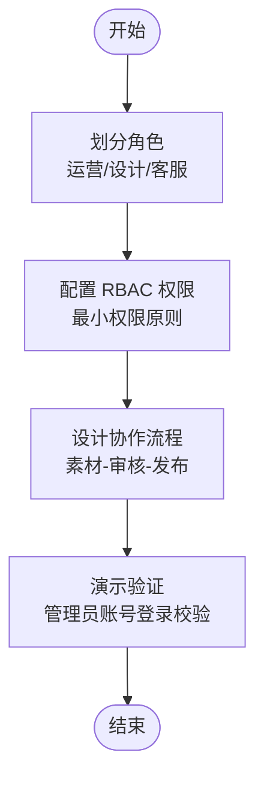
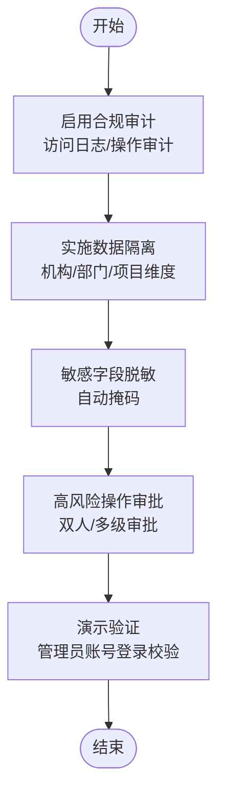
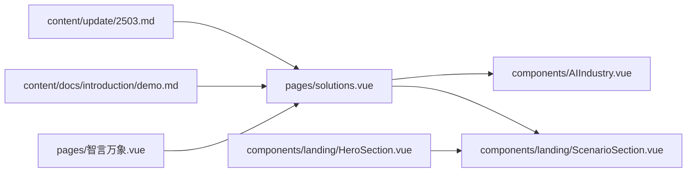

# 行业落地实践

<cite>
**本文引用的文件**
- [ScenarioSection.vue](file://components/landing/ScenarioSection.vue)
- [demo.md](file://content/docs/introduction/demo.md)
- [solutions.vue](file://pages/solutions.vue)
- [AIIndustry.vue](file://components/AIIndustry.vue)
- [2503.md](file://content/update/2503.md)
- [1.start.md](file://content/docs/introduction/1.start.md)
- [HeroSection.vue](file://components/landing/HeroSection.vue)
- [智言万象.vue](file://pages/智言万象.vue)
</cite>

## 目录
1. [引言](#引言)
2. [项目结构](#项目结构)
3. [核心组件](#核心组件)
4. [架构总览](#架构总览)
5. [详细组件分析](#详细组件分析)
6. [依赖分析](#依赖分析)
7. [性能考虑](#性能考虑)
8. [故障排查指南](#故障排查指南)
9. [结论](#结论)
10. [附录](#附录)

## 引言
本文件围绕 智言万象 平台在教育、电商、金融等行业的组织管理落地实践展开，结合 ScenarioSection.vue 展示的“企业级组织管理模块”场景，给出多校区/院系结构配置、电商运营/设计/客服权限划分、金融合规审计与数据隔离的实施方法，并基于 demo.md 中的管理员账号示例，提供各行业的配置与最佳实践参考路径。文档同时梳理平台能力边界与组织管理能力的演进，帮助读者在真实业务中高效落地。

## 项目结构
仓库采用 Nuxt + Vue 组件化结构，核心页面与落地场景组件位于 pages 与 components 目录，文档与更新日志位于 content 目录。与组织管理相关的要点包括：
- 场景展示组件：components/landing/ScenarioSection.vue
- 解决方案页面：pages/solutions.vue
- 行业能力卡片：components/AIIndustry.vue
- 组织管理能力演进记录：content/update/2503.md
- 平台能力介绍与场景说明：content/docs/introduction/1.start.md
- 演示环境与管理员账号：content/docs/introduction/demo.md
- 顶部能力标签（含组织管理）：components/landing/HeroSection.vue
- 金融合规案例展示：pages/智言万象.vue

**图表来源**
- [solutions.vue](file://pages/solutions.vue#L1-L120)
- [AIIndustry.vue](file://components/AIIndustry.vue#L1-L120)
- [ScenarioSection.vue](file://components/landing/ScenarioSection.vue#L1-L70)
- [HeroSection.vue](file://components/landing/HeroSection.vue#L60-L79)
- [智言万象.vue](file://pages/智言万象.vue#L1059-L1090)
- [1.start.md](file://content/docs/introduction/1.start.md#L1-L117)
- [demo.md](file://content/docs/introduction/demo.md#L1-L33)
- [2503.md](file://content/update/2503.md#L1-L15)

**章节来源**
- [solutions.vue](file://pages/solutions.vue#L1-L120)
- [AIIndustry.vue](file://components/AIIndustry.vue#L1-L120)
- [ScenarioSection.vue](file://components/landing/ScenarioSection.vue#L1-L70)
- [HeroSection.vue](file://components/landing/HeroSection.vue#L60-L79)
- [智言万象.vue](file://pages/智言万象.vue#L1059-L1090)
- [1.start.md](file://content/docs/introduction/1.start.md#L1-L117)
- [demo.md](file://content/docs/introduction/demo.md#L1-L33)
- [2503.md](file://content/update/2503.md#L1-L15)

## 核心组件
- 场景展示组件：展示“企业级组织管理模块”的能力说明与适用场景，强调“灵活配置角色权限、为不同部门分配编辑与阅读权限、高效实现数据隔离”。
- 解决方案页面：提供“AI 视觉创作、智能对话 Agent、知识库与文档、模型与数据能力、营销与应用集成”五大能力板块，体现组织管理在跨部门协作中的支撑作用。
- 行业能力卡片：以行业视角呈现 AI 能力矩阵，便于在教育/电商/金融等场景中映射组织管理需求。
- 组织管理能力演进：v1.5.0 新增 RBAC 权限控制系统，支持细粒度资源访问策略，优化团队协作流程。
- 平台能力介绍：明确平台定位与场景覆盖，包含“人工智能教育”“电商设计”“客户服务与营销”“智慧政务与公共服务”等，为行业落地提供场景参考。
- 演示环境与管理员账号：提供演示站点与管理员账号示例，便于在演示环境中验证组织管理配置。

**章节来源**
- [ScenarioSection.vue](file://components/landing/ScenarioSection.vue#L48-L66)
- [solutions.vue](file://pages/solutions.vue#L470-L620)
- [AIIndustry.vue](file://components/AIIndustry.vue#L146-L220)
- [2503.md](file://content/update/2503.md#L1-L15)
- [1.start.md](file://content/docs/introduction/1.start.md#L49-L117)
- [demo.md](file://content/docs/introduction/demo.md#L10-L33)

## 架构总览
下图从“场景—能力—组织管理—演示验证”的角度，展示平台在不同行业中的落地路径与关键触点。

**图表来源**
- [ScenarioSection.vue](file://components/landing/ScenarioSection.vue#L48-L66)
- [solutions.vue](file://pages/solutions.vue#L470-L620)
- [AIIndustry.vue](file://components/AIIndustry.vue#L146-L220)
- [2503.md](file://content/update/2503.md#L1-L15)
- [demo.md](file://content/docs/introduction/demo.md#L10-L33)

## 详细组件分析

### 教育行业：多校区/院系结构配置方案
- 场景定位：教育行业强调“多校区、院系结构”的组织形态，需要在平台中实现“校区/院系/班级/教师/学生”的层级化管理与数据隔离。
- 能力映射：结合“知识库与文档”“智能对话 Agent”“AI 视觉创作”，可支撑教学资源沉淀、智能答疑、课件生成等场景。
- 组织管理要点：
  - 以校区为一级单位，院系为二级单位，形成“校区-院系-班级/教研组”的树状结构。
  - 通过 RBAC 为不同角色（如教务管理员、院系主任、教师、助教、学生）分配资源访问权限，实现“教学资源只对授权人员可见”“作业/考试数据仅限相关角色访问”。
  - 通过“数据隔离”策略，确保各校区/院系的数据互不可见，避免交叉泄露。
- 演示验证：登录演示站点，使用管理员账号验证组织管理入口与权限分配效果。

**图表来源**
- [ScenarioSection.vue](file://components/landing/ScenarioSection.vue#L48-L66)
- [solutions.vue](file://pages/solutions.vue#L470-L620)
- [AIIndustry.vue](file://components/AIIndustry.vue#L146-L220)
- [2503.md](file://content/update/2503.md#L1-L15)
- [demo.md](file://content/docs/introduction/demo.md#L10-L33)

**章节来源**
- [ScenarioSection.vue](file://components/landing/ScenarioSection.vue#L48-L66)
- [solutions.vue](file://pages/solutions.vue#L470-L620)
- [AIIndustry.vue](file://components/AIIndustry.vue#L146-L220)
- [2503.md](file://content/update/2503.md#L1-L15)
- [demo.md](file://content/docs/introduction/demo.md#L10-L33)

### 电商行业：运营/设计/客服权限划分策略
- 场景定位：电商行业强调“运营、设计、客服”三大职能线的协同与权限边界，需要在平台中实现“跨部门协作、数据可见性控制、流程审批”。
- 能力映射：结合“AI 视觉创作”“营销与应用集成”“智能对话 Agent”，可支撑商品主图生成、活动海报制作、客服智能问答、内容营销等场景。
- 组织管理要点：
  - 运营：负责商品/活动/营销策略，应具备“营销内容发布、活动数据查看、报表导出”等权限。
  - 设计：负责视觉素材与物料，应具备“素材上传/编辑、模板库访问、发布预览”等权限。
  - 客服：负责用户咨询与售后，应具备“对话接入、FAQ 查询、工单处理、知识库检索”等权限。
  - 通过 RBAC 实现“最小权限原则”，避免越权访问敏感数据（如价格策略、库存数据）。
- 演示验证：登录演示站点，切换不同角色账号，验证各职能线的权限范围与协作流程。

**图表来源**
- [ScenarioSection.vue](file://components/landing/ScenarioSection.vue#L48-L66)
- [solutions.vue](file://pages/solutions.vue#L470-L620)
- [AIIndustry.vue](file://components/AIIndustry.vue#L146-L220)
- [2503.md](file://content/update/2503.md#L1-L15)
- [demo.md](file://content/docs/introduction/demo.md#L10-L33)

**章节来源**
- [ScenarioSection.vue](file://components/landing/ScenarioSection.vue#L48-L66)
- [solutions.vue](file://pages/solutions.vue#L470-L620)
- [AIIndustry.vue](file://components/AIIndustry.vue#L146-L220)
- [2503.md](file://content/update/2503.md#L1-L15)
- [demo.md](file://content/docs/introduction/demo.md#L10-L33)

### 金融行业：合规审计与数据隔离实施方法
- 场景定位：金融行业强调“合规审计”“数据隔离”“敏感信息保护”，需要在平台中实现“字段级脱敏、访问日志、权限审批、数据生命周期管理”。
- 能力映射：结合“模型与数据能力”“知识库与文档”，可支撑“数据解析、内容总结、图表生成、合规文档沉淀”等场景。
- 组织管理要点：
  - 合规审计：启用“访问日志”“操作审计”“权限变更追踪”，确保每次数据访问与修改可追溯。
  - 数据隔离：按“机构/部门/项目”维度实现数据隔离，禁止跨域访问；对敏感字段（如身份证、银行卡号）实施“自动掩码”。
  - 审批流程：对高风险操作（如导出、修改、删除）设置“双人审批”或“多级审批”。
- 演示验证：登录演示站点，使用管理员账号检查组织管理与审计功能入口，验证权限与隔离策略。

**图表来源**
- [ScenarioSection.vue](file://components/landing/ScenarioSection.vue#L48-L66)
- [solutions.vue](file://pages/solutions.vue#L470-L620)
- [AIIndustry.vue](file://components/AIIndustry.vue#L146-L220)
- [2503.md](file://content/update/2503.md#L1-L15)
- [demo.md](file://content/docs/introduction/demo.md#L10-L33)
- [智言万象.vue](file://pages/智言万象.vue#L1059-L1090)

**章节来源**
- [ScenarioSection.vue](file://components/landing/ScenarioSection.vue#L48-L66)
- [solutions.vue](file://pages/solutions.vue#L470-L620)
- [AIIndustry.vue](file://components/AIIndustry.vue#L146-L220)
- [2503.md](file://content/update/2503.md#L1-L15)
- [demo.md](file://content/docs/introduction/demo.md#L10-L33)
- [智言万象.vue](file://pages/智言万象.vue#L1059-L1090)

## 依赖分析
- 组件耦合关系：
  - pages/solutions.vue 作为入口页面，组合 components/AIIndustry.vue 与 components/landing/ScenarioSection.vue，形成“能力—场景—组织管理”的串联。
  - components/landing/HeroSection.vue 提供“组织管理”能力标签，强化组织管理在平台能力中的定位。
  - content/update/2503.md 作为组织管理能力演进的依据，指导配置策略。
  - content/docs/introduction/demo.md 提供演示与管理员账号，支撑配置验证。
  - pages/智言万象.vue 展示金融合规案例，为金融行业落地提供参考。

**图表来源**
- [solutions.vue](file://pages/solutions.vue#L1-L120)
- [AIIndustry.vue](file://components/AIIndustry.vue#L1-L120)
- [ScenarioSection.vue](file://components/landing/ScenarioSection.vue#L1-L70)
- [HeroSection.vue](file://components/landing/HeroSection.vue#L60-L79)
- [2503.md](file://content/update/2503.md#L1-L15)
- [demo.md](file://content/docs/introduction/demo.md#L10-L33)
- [智言万象.vue](file://pages/智言万象.vue#L1059-L1090)

**章节来源**
- [solutions.vue](file://pages/solutions.vue#L1-L120)
- [AIIndustry.vue](file://components/AIIndustry.vue#L1-L120)
- [ScenarioSection.vue](file://components/landing/ScenarioSection.vue#L1-L70)
- [HeroSection.vue](file://components/landing/HeroSection.vue#L60-L79)
- [2503.md](file://content/update/2503.md#L1-L15)
- [demo.md](file://content/docs/introduction/demo.md#L10-L33)
- [智言万象.vue](file://pages/智言万象.vue#L1059-L1090)

## 性能考虑
- 组织管理配置的复杂度与性能影响：在大规模组织中，建议采用“分层权限+缓存策略”，减少权限计算开销。
- 数据隔离与查询性能：对隔离维度较多的场景，建议在查询层引入“按组织维度的索引”与“读写分离”，避免跨域扫描。
- 演示环境限制：演示站点为每日自动还原，不适合承载生产级数据与高并发请求，建议在私有化部署环境中进行性能压测与容量评估。

## 故障排查指南
- 登录演示站点失败：
  - 确认管理员账号与密码是否正确，参考演示文档中的账号信息。
  - 若界面无图标显示，尝试刷新页面或更换浏览器（推荐 Chrome 浏览器）。
- 权限配置不生效：
  - 检查角色与资源绑定是否正确，确认 RBAC 策略未被覆盖或冲突。
  - 核对数据隔离策略是否按校区/院系/机构维度正确配置。
- 合规审计缺失：
  - 确认审计功能已启用，检查访问日志与操作审计是否正常记录。
  - 对高风险操作补充审批流程，确保流程闭环。

**章节来源**
- [demo.md](file://content/docs/introduction/demo.md#L10-L33)
- [2503.md](file://content/update/2503.md#L1-L15)

## 结论
智言万象 平台通过“企业级组织管理模块”与“RBAC 权限控制”能力，为教育、电商、金融等行业的组织管理落地提供了可复制的实践框架。结合“AI 视觉创作、智能对话 Agent、知识库与文档、模型与数据能力、营销与应用集成”等能力板块，可在多校区/院系、运营/设计/客服、合规审计/数据隔离等场景中实现“职责清晰、权限可控、流程规范、审计可溯”。建议在私有化部署环境中完成组织结构与权限策略的最终验证，并结合演示站点进行快速试错与优化。

## 附录
- 教育行业最佳实践参考路径：
  - 组织结构：校区/院系/班级/角色
  - 权限策略：最小权限、按角色授权、数据隔离
  - 能力映射：知识库与文档、智能对话 Agent、AI 视觉创作
- 电商行业最佳实践参考路径：
  - 角色划分：运营/设计/客服
  - 权限策略：最小权限、跨部门协作、审批流程
  - 能力映射：AI 视觉创作、营销与应用集成、智能对话 Agent
- 金融行业最佳实践参考路径：
  - 合规审计：访问日志、操作审计、权限变更追踪
  - 数据隔离：机构/部门/项目维度、敏感字段脱敏
  - 能力映射：模型与数据能力、知识库与文档