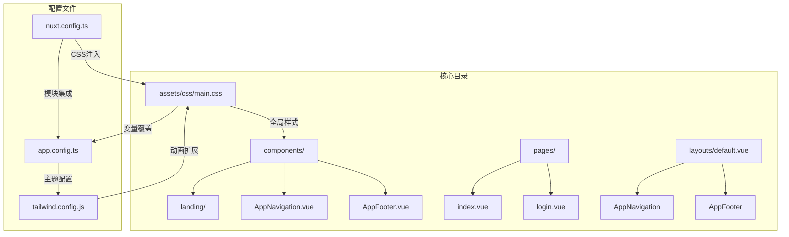
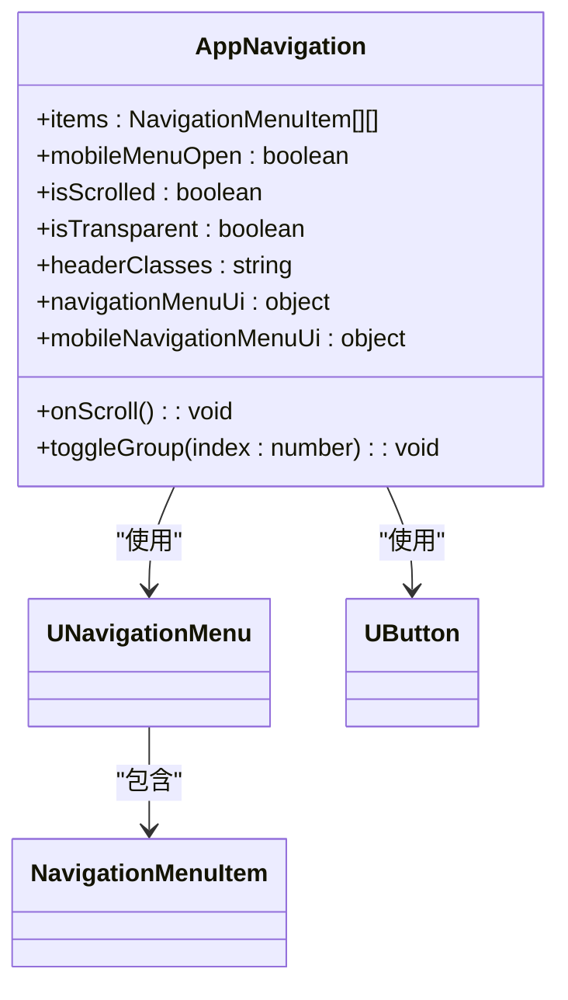
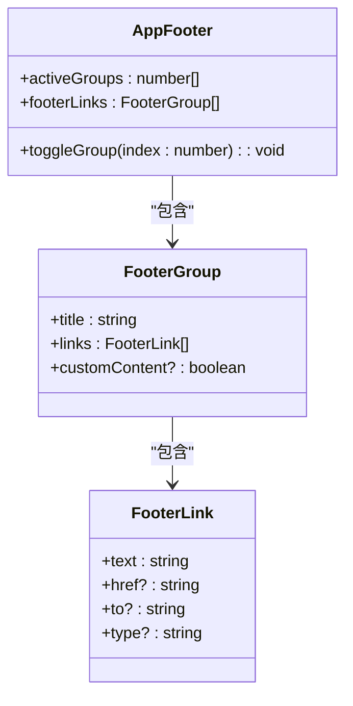
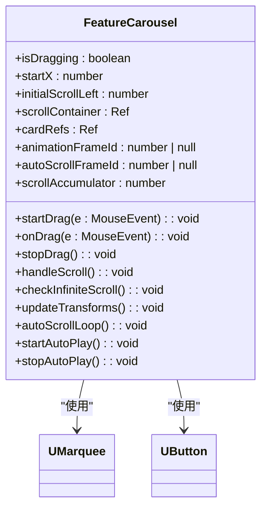

# UI个性化配置

<cite>
**本文档引用文件**  
- [app.config.ts](file://app.config.ts)
- [main.css](file://assets/css/main.css)
- [tailwind.config.js](file://tailwind.config.js)
- [nuxt.config.ts](file://nuxt.config.ts)
- [AppNavigation.vue](file://components/AppNavigation.vue)
- [AppFooter.vue](file://components/AppFooter.vue)
- [HeroSection.vue](file://components/landing/HeroSection.vue)
- [FeatureCarousel.vue](file://components/landing/FeatureCarousel.vue)
</cite>

## 目录
1. [简介](#简介)
2. [项目结构](#项目结构)
3. [核心组件](#核心组件)
4. [架构概述](#架构概述)
5. [详细组件分析](#详细组件分析)
6. [依赖分析](#依赖分析)
7. [性能考虑](#性能考虑)
8. [故障排除指南](#故障排除指南)
9. [结论](#结论)
10. [附录](#附录)（如有必要）

## 简介
本文档全面说明智言万象平台的UI自定义能力，涵盖首页、登录页、Logo、加载动画等界面元素的替换与样式调整方法。基于`app.config.ts`中的主题配置项和Tailwind CSS的定制化支持，提供具体的配置步骤和代码示例。指导用户如何通过修改`main.css`扩展样式，以及如何在不破坏原有布局的前提下进行品牌化设计。包含多场景定制案例和响应式适配建议。

## 项目结构
智言万象平台采用基于Nuxt 4 + Vue 3的现代化前端架构，结合Tailwind CSS实现高度可定制的UI系统。项目结构清晰，按功能划分目录，便于维护和扩展。



**图示来源**  
- [app.config.ts](file://app.config.ts)
- [main.css](file://assets/css/main.css)
- [tailwind.config.js](file://tailwind.config.js)
- [nuxt.config.ts](file://nuxt.config.ts)

**本节来源**  
- [README.md](file://README.md)

## 核心组件
智言万象平台的核心UI组件包括导航栏、页脚、首页英雄区域和功能轮播等。这些组件通过Nuxt UI和Tailwind CSS构建，支持高度的样式定制和行为配置。

**本节来源**  
- [components/AppNavigation.vue](file://components/AppNavigation.vue)
- [components/AppFooter.vue](file://components/AppFooter.vue)
- [components/landing/HeroSection.vue](file://components/landing/HeroSection.vue)
- [components/landing/FeatureCarousel.vue](file://components/landing/FeatureCarousel.vue)

## 架构概述
智言万象平台的UI架构基于Nuxt 4的模块化设计，通过`@nuxt/ui`提供基础组件库，`@nuxt/content`支持内容驱动，Tailwind CSS实现原子化样式管理。整体架构支持SSG（静态站点生成），适配Vercel等静态部署环境。

```mermaid
graph TD
A[Nuxt 4] --> B[@nuxt/ui]
A --> C[@nuxt/content]
A --> D[Tailwind CSS]
B --> E[UNavigationMenu]
B --> F[UButton]
B --> G[UBanner]
C --> H[Markdown内容]
D --> I[原子化类名]
I --> J[响应式设计]
J --> K[移动端适配]
E --> L[AppNavigation.vue]
F --> M[按钮样式]
G --> N[AppBanner.vue]
H --> O[文档中心]
O --> P[.navigation.yml]
```

**图示来源**  
- [nuxt.config.ts](file://nuxt.config.ts)
- [app.config.ts](file://app.config.ts)
- [tailwind.config.js](file://tailwind.config.js)

## 详细组件分析
### 导航栏分析
`AppNavigation.vue`组件实现了响应式导航，支持桌面端和移动端的不同布局。通过`UNavigationMenu`组件配置导航项，并根据滚动位置动态调整背景透明度。



**图示来源**  
- [components/AppNavigation.vue](file://components/AppNavigation.vue#L140-L308)

**本节来源**  
- [components/AppNavigation.vue](file://components/AppNavigation.vue)

### 页脚分析
`AppFooter.vue`组件包含公司信息、链接组和社交媒体图标。支持移动端折叠交互，通过`activeGroups`管理展开状态。



**图示来源**  
- [components/AppFooter.vue](file://components/AppFooter.vue#L130-L205)

**本节来源**  
- [components/AppFooter.vue](file://components/AppFooter.vue)

### 首页英雄区域分析
`HeroSection.vue`组件包含动态打字机效果、跑马灯展示和响应式布局。通过`marqueeImageGroups`计算属性生成轮播图片。

```mermaid
classDiagram
class HeroSection {
+isMobile : boolean
+typeWriterText : string
+sentenceIndex : number
+charIndex : number
+isDeleting : boolean
+typeTimeout : NodeJS.Timeout | null
+allPluginImages : ComputedRef<string[]>
+marqueeImageGroups : ComputedRef<{first : string[], second : string[]}>
+typeWriter() : void
+shuffleArray(array : string[]) : string[]
+checkDevice() : void
}
HeroSection --> UMarquee : "使用"
HeroSection --> UButton : "使用"
```

**图示来源**  
- [components/landing/HeroSection.vue](file://components/landing/HeroSection.vue#L193-L354)

**本节来源**  
- [components/landing/HeroSection.vue](file://components/landing/HeroSection.vue)

### 功能轮播分析
`FeatureCarousel.vue`组件实现3D轮播效果，支持鼠标拖拽和自动滚动。通过`updateTransforms`方法实现透视变换。



**图示来源**  
- [components/landing/FeatureCarousel.vue](file://components/landing/FeatureCarousel.vue#L86-L307)

**本节来源**  
- [components/landing/FeatureCarousel.vue](file://components/landing/FeatureCarousel.vue)

## 依赖分析
智言万象平台的UI组件依赖于多个Nuxt模块和第三方库，形成完整的UI生态系统。

```mermaid
graph TD
A[智言万象] --> B[@nuxt/ui]
A --> C[@nuxt/content]
A --> D[Tailwind CSS]
A --> E[@nuxtjs/color-mode]
B --> F[UNavigationMenu]
B --> G[UButton]
B --> H[UBanner]
B --> I[UMarquee]
C --> J[Markdown解析]
D --> K[原子化样式]
E --> L[深色模式切换]
F --> M[AppNavigation.vue]
G --> N[按钮组件]
H --> O[AppBanner.vue]
I --> P[HeroSection.vue]
I --> Q[FeatureCarousel.vue]
```

**图示来源**  
- [package.json](file://package.json)
- [nuxt.config.ts](file://nuxt.config.ts)

**本节来源**  
- [package.json](file://package.json)
- [nuxt.config.ts](file://nuxt.config.ts)

## 性能考虑
智言万象平台在UI设计中充分考虑性能优化，包括：
- 使用`requestAnimationFrame`优化滚动动画
- 通过`passive: true`提升滚动事件性能
- 图片懒加载（`loading="lazy"`）
- 异步解码（`decoding="async"`）
- 虚拟滚动和无限循环优化

**本节来源**  
- [components/landing/HeroSection.vue](file://components/landing/HeroSection.vue)
- [components/landing/FeatureCarousel.vue](file://components/landing/FeatureCarousel.vue)

## 故障排除指南
### 常见问题
1. **导航栏透明度不生效**：检查`isTransparent`计算属性的条件逻辑
2. **轮播组件卡顿**：确保在移动设备上适当降低3D效果参数
3. **深色模式切换失败**：验证`colorMode`配置和CSS变量覆盖

### 调试建议
- 使用浏览器开发者工具检查CSS变量
- 验证Tailwind类名是否正确生成
- 检查Nuxt模块是否正确注册

**本节来源**  
- [components/AppNavigation.vue](file://components/AppNavigation.vue)
- [components/landing/FeatureCarousel.vue](file://components/landing/FeatureCarousel.vue)
- [assets/css/main.css](file://assets/css/main.css)

## 结论
智言万象平台提供了完整的UI自定义解决方案，通过`app.config.ts`的主题配置、`tailwind.config.js`的动画扩展和`main.css`的样式覆盖，用户可以轻松实现品牌化设计。组件设计充分考虑响应式适配和性能优化，支持从首页到登录页的全面定制。

## 附录
### 主题配置参考
```typescript
// app.config.ts
export default defineAppConfig({
  ui: {
    colors: {
      primary: 'violet' // 可选值: 'violet', 'blue', 'rose', 'cyan'等
    },
    icons: {
      arrowDown: 'i-ph-arrow-down',
      check: 'i-ph-check',
      error: 'i-ph-x-circle',
      // ...其他图标映射
    }
  }
})
```

### Tailwind动画配置
```javascript
// tailwind.config.js
theme: {
  extend: {
    animation: {
      'fade-in': 'fadeIn 0.5s ease-in-out',
      'slide-up': 'slideUp 0.5s ease-out',
      'bounce-gentle': 'bounceGentle 2s infinite',
      'marquee-vertical': 'marqueeVertical 60s linear infinite',
    },
    keyframes: {
      marqueeVertical: {
        '0%': { transform: 'translateY(0)' },
        '100%': { transform: 'translateY(-50%)' },
      },
      // ...其他关键帧
    },
  },
}
```