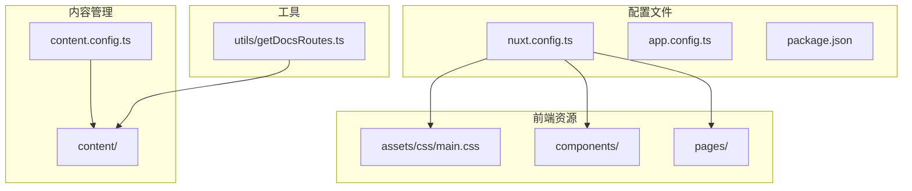
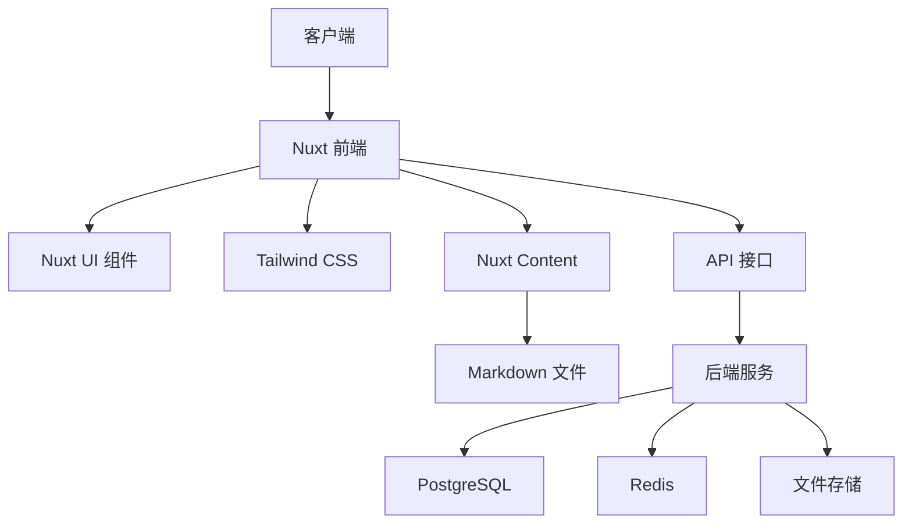
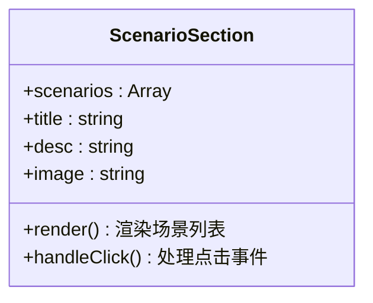
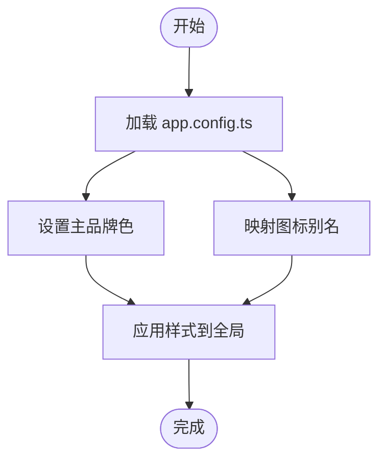

# 全开源私有化部署方案

<cite>
**本文档引用文件**
- [README.md](file://README.md)
- [package.json](file://package.json)
- [nuxt.config.ts](file://nuxt.config.ts)
- [app.config.ts](file://app.config.ts)
- [main.css](file://assets/css/main.css)
- [ScenarioSection.vue](file://components/landing/ScenarioSection.vue)
- [1.configuration.md](file://content/docs/introduction/1.configuration.md)
- [2.docker-installation.md](file://content/docs/introduction/2.docker-installation.md)
- [1.start.md](file://content/docs/introduction/1.start.md)
- [11.manual-installation.md](file://content/docs/introduction/11.manual-installation.md)
- [sources.md](file://content/docs/framework/sources.md)
- [getDocsRoutes.ts](file://utils/getDocsRoutes.ts)
</cite>

## 目录

1. [引言](#引言)
2. [项目结构](#项目结构)
3. [核心组件](#核心组件)
4. [架构概述](#架构概述)
5. [详细组件分析](#详细组件分析)
6. [依赖分析](#依赖分析)
7. [性能考量](#性能考量)
8. [故障排除指南](#故障排除指南)
9. [结论](#结论)

## 引言

必创AI（BuidAI）是一个基于 Nuxt 4 和 Vue 3 构建的企业级 AI 应用开发平台模板，专为 AI 应用、SaaS 产品官网和文档中心设计。本平台采用全开源模式，支持私有化部署，确保企业数据安全与可控性。通过可视化配置界面，用户可零代码搭建具备智能体、知识库、工作流、大模型聚合等原生 AI 能力的应用，并集成用户注册、会员订阅、支付计费等商业闭环功能。

必创AI 的核心优势在于其完全开源的特性，天然满足企业私有化需求，支持模型本地化部署和国产算力硬件，保障数据隐私。平台同时提供自定义 UI 配置能力，支持首页、登录页、Logo 和加载动画的个性化设置，实现“全开源 & DIY 装修”的灵活部署模式。

## 项目结构

必创AI 项目采用模块化设计，结构清晰，便于维护和扩展。主要目录包括：

- `assets/css/`：存放全局样式文件，如 `main.css`
- `components/`：包含各类 Vue 组件，如落地页组件、导航栏、页脚等
- `content/`：以 Markdown 格式存储文档和博客内容
- `layouts/`：定义页面布局，如默认布局 `default.vue`
- `pages/`：路由页面，包括首页、文档、博客等
- `utils/`：工具函数，如生成文档路由的 `getDocsRoutes.ts`



**图示来源**
- [nuxt.config.ts](file://nuxt.config.ts#L1-L91)
- [content.config.ts](file://content.config.ts#L1-L29)
- [getDocsRoutes.ts](file://utils/getDocsRoutes.ts#L1-L58)

**本节来源**
- [README.md](file://README.md#L1-L117)

## 核心组件

必创AI 的核心组件围绕 Nuxt 4 和 Vue 3 构建，集成 Nuxt UI、Tailwind CSS 和 Nuxt Content，兼顾开发效率、可维护性和 SEO。关键组件包括：

- **Nuxt UI**：提供丰富的 UI 组件库，基于 Tailwind CSS
- **Tailwind CSS**：用于快速构建响应式用户界面
- **Nuxt Content**：基于 Markdown 的内容管理系统，支持文档和博客
- **自动导入组件**：`components/` 目录下的组件可自动导入，无需手动注册

平台通过 `nuxt.config.ts` 配置模块、预渲染路由和全局 Head 信息，确保 SEO 友好和静态化输出。`app.config.ts` 用于配置 Nuxt UI 的全局样式和图标映射。

**本节来源**
- [README.md](file://README.md#L3-L45)
- [nuxt.config.ts](file://nuxt.config.ts#L1-L91)
- [app.config.ts](file://app.config.ts#L1-L83)

## 架构概述

必创AI 采用前后端分离架构，前端基于 Nuxt 4 构建，后端通过 API 提供服务。整体架构如下：



前端通过 `nuxt.config.ts` 配置 Nitro 预设为静态输出，适配 Vercel Static 部署。内容系统通过 `content.config.ts` 定义集合和校验 schema，支持多级目录和 `.navigation.yml` 导航配置。预渲染路由通过 `getDocsRoutes.ts` 动态生成，确保所有文档页面均可被静态生成。

**图示来源**
- [nuxt.config.ts](file://nuxt.config.ts#L40-L50)
- [content.config.ts](file://content.config.ts#L4-L29)
- [getDocsRoutes.ts](file://utils/getDocsRoutes.ts#L1-L58)

**本节来源**
- [README.md](file://README.md#L56-L63)
- [nuxt.config.ts](file://nuxt.config.ts#L1-L91)

## 详细组件分析

### ScenarioSection.vue 分析

`ScenarioSection.vue` 是一个展示必创AI 多场景应用的组件，其中“全开源 & DIY 装修”场景突出了平台的私有化部署和自定义能力。



该组件通过 `v-for` 循环渲染 `scenarios` 数组，每个场景包含标题、描述和图片。支持自定义 Logo、首页和登录页，体现了平台的高可定制性。

**图示来源**
- [ScenarioSection.vue](file://components/landing/ScenarioSection.vue#L1-L70)

**本节来源**
- [ScenarioSection.vue](file://components/landing/ScenarioSection.vue#L1-L70)

### 自定义 UI 配置

必创AI 支持通过 `app.config.ts` 和 `main.css` 进行全局 UI 配置。`app.config.ts` 可定义主品牌色、图标映射等；`main.css` 可覆盖 Nuxt UI 的默认 CSS 变量，实现深色模式切换和自定义样式。



**图示来源**
- [app.config.ts](file://app.config.ts#L1-L83)
- [main.css](file://assets/css/main.css#L1-L145)

**本节来源**
- [app.config.ts](file://app.config.ts#L1-L83)
- [main.css](file://assets/css/main.css#L1-L145)

## 依赖分析

必创AI 的依赖分为开发依赖和生产依赖，通过 `package.json` 管理。

```mermaid
graph LR
A[必创AI] --> B[@nuxt/ui]
A --> C[@nuxt/content]
A --> D[Tailwind CSS]
A --> E[Vue 3]
A --> F[Nuxt 4]
B --> G[Tailwind CSS]
C --> H[Markdown 解析]
F --> I[Nitro 引擎]
```

核心依赖包括：
- `@nuxt/ui`：UI 组件库
- `@nuxt/content`：内容管理模块
- `tailwindcss`：CSS 框架
- `nuxt`：Nuxt 4 核心
- `vue`：Vue 3 框架

**图示来源**
- [package.json](file://package.json#L1-L48)

**本节来源**
- [package.json](file://package.json#L1-L48)

## 性能考量

必创AI 通过以下方式优化性能：
- **预渲染**：使用 Nitro `vercel-static` 预设，自动预渲染所有文档页面
- **静态化**：优先静态化内容，减少服务器负载
- **类型检查分离**：开发时禁用类型检查，通过独立脚本执行，提升开发速度
- **资源优化**：合理使用动画和图片，避免过度渲染

## 故障排除指南

常见问题及解决方案：
- **依赖安装失败**：检查 Node.js 版本是否 ≥18，使用淘宝镜像加速
- **服务启动失败**：确认 PostgreSQL 和 Redis 服务已启动，检查 `.env` 配置
- **页面无法访问**：检查 `SERVER_PORT` 是否被占用，确认防火墙设置

**本节来源**
- [11.manual-installation.md](file://content/docs/introduction/11.manual-installation.md#L1-L237)
- [2.docker-installation.md](file://content/docs/introduction/2.docker-installation.md#L1-L83)

## 结论

必创AI 作为一个全开源的企业级 AI 应用开发平台，提供了完整的私有化部署方案。通过 Docker 或手动安装，企业可在内部服务器部署平台，确保数据安全。平台支持自定义 UI 配置，满足个性化需求，并通过高可用架构实现稳定运行。结合“全开源 & DIY 装修”理念，必创AI 为企业提供了灵活、安全、高效的 AI 应用开发基础设施。
