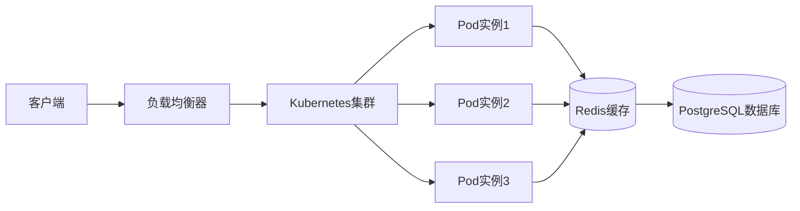
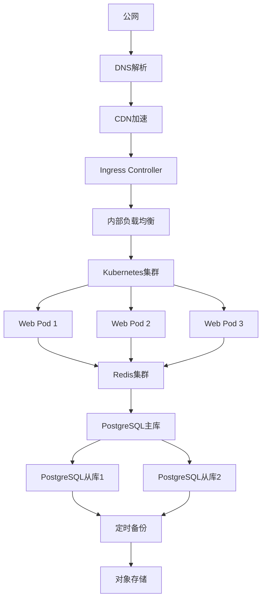

# 高可用架构部署

<cite>
**本文档引用的文件**
- [nuxt.config.ts](file://nuxt.config.ts)
- [package.json](file://package.json)
- [README.md](file://README.md)
- [content.config.ts](file://content.config.ts)
- [tailwind.config.js](file://tailwind.config.js)
- [content/docs/introduction/2.docker-installation.md](file://content/docs/introduction/2.docker-installation.md)
- [content/docs/introduction/11.manual-installation.md](file://content/docs/introduction/11.manual-installation.md)
- [content/docs/introduction/1.bt.md](file://content/docs/introduction/1.bt.md)
- [utils/getDocsRoutes.ts](file://utils/getDocsRoutes.ts)
- [app.config.ts](file://app.config.ts)
</cite>

## 目录

1. [简介](#简介)
2. [项目结构](#项目结构)
3. [核心组件](#核心组件)
4. [高可用架构设计](#高可用架构设计)
5. [Docker容器化部署](#docker容器化部署)
6. [Kubernetes编排与负载均衡](#kubernetes编排与负载均衡)
7. [多实例部署与会话保持](#多实例部署与会话保持)
8. [数据同步与灾备恢复](#数据同步与灾备恢复)
9. [生产环境推荐拓扑](#生产环境推荐拓扑)
10. [性能调优建议](#性能调优建议)
11. [故障排查与日志管理](#故障排查与日志管理)

## 简介

智言AI（智言万象）是一个企业级AI应用开发平台，支持私有化部署与高可用架构。本指南旨在为企业提供完整的高可用部署方案，涵盖Docker容器化、Kubernetes编排、负载均衡配置、多实例部署策略、数据同步及灾备恢复机制。通过结合`nuxt.config.ts`中的运行时配置，详细说明如何实现会话保持、自动伸缩和系统稳定性保障，确保在生产环境中稳定可靠运行。

## 项目结构

本项目基于Nuxt 4 + Vue 3构建，采用模块化设计，支持静态生成与内容驱动。整体结构清晰，便于维护与扩展。

```mermaid
graph TD
A[根目录] --> B[assets/css]
A --> C[components]
A --> D[content]
A --> E[layouts]
A --> F[pages]
A --> G[utils]
A --> H[配置文件]
H --> I[nuxt.config.ts]
H --> J[package.json]
H --> K[app.config.ts]
H --> L[tailwind.config.js]
D --> M[blog]
D --> N[docs]
D --> O[update]
C --> P[landing]
C --> Q[AppNavigation.vue]
C --> R[AppFooter.vue]
F --> S[index.vue]
F --> T[docs/[...slug].vue]
F --> U[blog/[...slug].vue]
```

**图示来源**
- [nuxt.config.ts](file://nuxt.config.ts)
- [README.md](file://README.md)

**本节来源**
- [README.md](file://README.md#L13-L45)

## 核心组件

项目核心由Nuxt框架驱动，集成Nuxt UI、Tailwind CSS与Nuxt Content三大模块，实现前端渲染与内容管理的统一。通过Nitro引擎进行静态预渲染，适配Vercel等静态部署平台。

关键配置包括：
- 使用SQLite作为内容数据库
- 启用DevTools开发工具
- 全局Head集中管理SEO信息
- 自动预渲染文档路由

**本节来源**
- [nuxt.config.ts](file://nuxt.config.ts#L4-L90)
- [package.json](file://package.json#L29-L38)

## 高可用架构设计

为实现高可用性，系统需具备以下能力：
- 多实例并行运行，避免单点故障
- 负载均衡分发请求
- 数据持久化与同步
- 自动伸缩应对流量波动
- 故障转移与灾备恢复

系统通过Docker容器封装应用，利用Kubernetes进行编排调度，结合Redis实现会话共享，PostgreSQL保障数据一致性。



**图示来源**
- [nuxt.config.ts](file://nuxt.config.ts)
- [content/docs/introduction/11.manual-installation.md](file://content/docs/introduction/11.manual-installation.md)

## Docker容器化部署

项目提供完整的Docker部署方案，支持一键部署。

### 环境准备

最低配置要求：
- CPU：≥2核（建议4核）
- 内存：≥4GB RAM（建议8GB）
- 存储：≥5GB 空闲空间

依赖软件：
- Docker ≥20.10.0
- Docker Compose

可通过以下命令验证安装：

```bash
docker --version
docker compose version
```

### 部署步骤

1. **获取代码**

```bash
git clone https://github.com/BidingCC/智言AI.git ./智言AI
```

2. **配置环境变量**

进入项目根目录，复制示例配置：

```bash
cd 智言AI
cp .env.example .env
```

根据实际环境修改`.env`文件，特别是`APP_DOMAIN`、`DB_HOST`、`REDIS_HOST`等关键参数。

3. **启动服务**

```bash
docker compose up -d
```

构建完成后，访问 `http://localhost:4090/install` 进行初始化配置。

**本节来源**
- [content/docs/introduction/2.docker-installation.md](file://content/docs/introduction/2.docker-installation.md)
- [content/docs/introduction/11.manual-installation.md](file://content/docs/introduction/11.manual-installation.md#L90-L206)

## Kubernetes编排与负载均衡

在生产环境中，推荐使用Kubernetes进行容器编排，实现自动伸缩与故障恢复。

### 部署配置要点

- 使用Deployment管理Pod副本
- 配置Service实现内部负载均衡
- 使用Ingress暴露外部访问端口
- 配置健康检查与就绪探针

### 负载均衡策略

建议采用轮询或最少连接算法，结合会话保持（Session Affinity）确保用户请求被正确路由。

```yaml
apiVersion: v1
kind: Service
metadata:
  name: 智言万象-service
spec:
  type: LoadBalancer
  sessionAffinity: ClientIP
  sessionAffinityConfig:
    clientIP:
      timeoutSeconds: 10800
  ports:
    - port: 80
      targetPort: 4090
  selector:
    app: 智言万象
```

**本节来源**
- [content/docs/introduction/11.manual-installation.md](file://content/docs/introduction/11.manual-installation.md#L111-L114)
- [nuxt.config.ts](file://nuxt.config.ts#L41-L50)

## 多实例部署与会话保持

### PM2集群模式部署

项目支持PM2集群模式，可在单机运行多个实例：

```env
PM2_EXEC_MODE=cluster
PM2_INSTANCES=4
```

通过`PM2_INSTANCES`设置实例数量，充分利用多核CPU。

### 会话保持实现

由于应用为无状态服务，用户会话通过Redis集中管理：

```env
REDIS_HOST=redis-host
REDIS_PORT=6379
REDIS_DB=0
```

所有实例共享同一Redis实例，确保会话数据一致性。

### 自动伸缩策略

结合Kubernetes HPA（Horizontal Pod Autoscaler），可根据CPU使用率自动扩缩容：

```yaml
apiVersion: autoscaling/v2
kind: HorizontalPodAutoscaler
metadata:
  name: 智言万象-hpa
spec:
  scaleTargetRef:
    apiVersion: apps/v1
    kind: Deployment
    name: 智言万象
  minReplicas: 2
  maxReplicas: 10
  metrics:
  - type: Resource
    resource:
      name: cpu
      target:
        type: Utilization
        averageUtilization: 70
```

**本节来源**
- [nuxt.config.ts](file://nuxt.config.ts#L41-L50)
- [content/docs/introduction/11.manual-installation.md](file://content/docs/introduction/11.manual-installation.md#L111-L122)
- [utils/getDocsRoutes.ts](file://utils/getDocsRoutes.ts#L17-L57)

## 数据同步与灾备恢复

### 数据库配置

使用PostgreSQL作为主数据库，确保ACID特性：

```env
DB_TYPE=postgres
DB_HOST=localhost
DB_PORT=5432
DB_USERNAME=postgres
DB_PASSWORD=postgres
DB_DATABASE=智言万象
```

### 数据同步机制

- 所有写操作通过主库执行
- 读操作可负载均衡至从库
- 使用逻辑复制或流复制实现主从同步

### 灾备恢复方案

1. **定期备份**

配置每日自动备份：

```bash
pg_dump 智言万象 > backup_$(date +%Y%m%d).sql
```

2. **异地容灾**

将备份文件同步至对象存储（如S3、OSS），实现异地保存。

3. **快速恢复**

提供恢复脚本，支持一键恢复数据库：

```bash
psql 智言万象 < backup_20250415.sql
```

4. **监控告警**

配置数据库连接数、慢查询、磁盘空间等监控指标，及时发现异常。

**本节来源**
- [content/docs/introduction/11.manual-installation.md](file://content/docs/introduction/11.manual-installation.md#L131-L148)
- [package.json](file://package.json#L30)

## 生产环境推荐拓扑

推荐采用以下生产环境架构：



**图示来源**
- [content/docs/introduction/11.manual-installation.md](file://content/docs/introduction/11.manual-installation.md)
- [nuxt.config.ts](file://nuxt.config.ts)

## 性能调优建议

### 前端优化

- 启用Gzip压缩
- 静态资源CDN分发
- 合理设置浏览器缓存
- 图片懒加载

### 后端优化

- 数据库索引优化
- 查询缓存（Redis）
- 连接池配置
- 日志级别控制

### 容器资源限制

在`.env`中配置合理资源限制：

```env
DOCKER_MEMORY_LIMIT=6144M
DOCKER_CPU_LIMIT=2.0
DOCKER_MEMORY_RESERVATION=512M
```

避免单个容器占用过多资源。

### 日志清理

配置日志自动清理：

```env
LOG_CLEAN_INTERVAL=3
```

定期清理过期日志，防止磁盘占满。

**本节来源**
- [content/docs/introduction/11.manual-installation.md](file://content/docs/introduction/11.manual-installation.md#L195-L200)
- [nuxt.config.ts](file://nuxt.config.ts#L12-L15)

## 故障排查与日志管理

### 常见问题处理

1. **服务无法启动**
   - 检查端口占用：`netstat -an | grep 4090`
   - 查看Docker日志：`docker logs 智言万象-nodejs`

2. **数据库连接失败**
   - 检查`DB_HOST`、`DB_PORT`配置
   - 验证网络连通性

3. **Redis连接超时**
   - 检查`REDIS_HOST`配置
   - 验证Redis服务状态

### 日志管理

- 所有日志输出至`../../logs/pm2`目录
- 支持`error`、`warn`、`debug`、`fatal`、`log`五种级别
- 可通过`LOG_LEVELS`和`LOG_WRITE_LEVELS`控制输出

```env
LOG_LEVELS=error,warn,debug,fatal
LOG_WRITE_LEVELS=error,warn,debug,fatal,log
LOG_TO_FILE=true
```

**本节来源**
- [content/docs/introduction/11.manual-installation.md](file://content/docs/introduction/11.manual-installation.md#L170-L180)
- [content/docs/introduction/1.bt.md](file://content/docs/introduction/1.bt.md#L98-L104)
