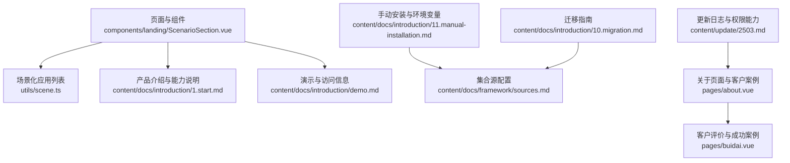
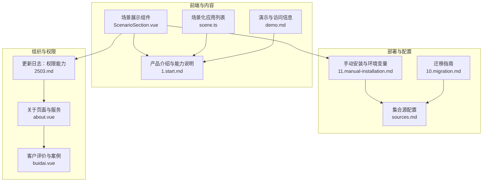
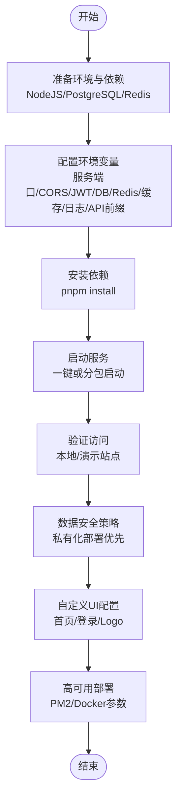
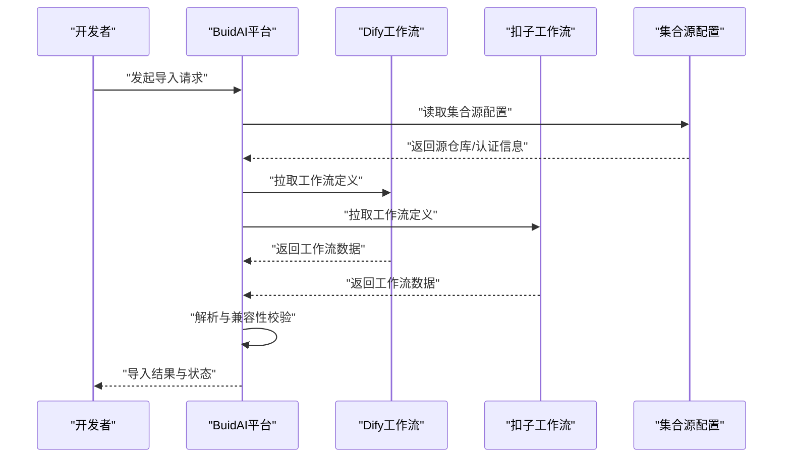
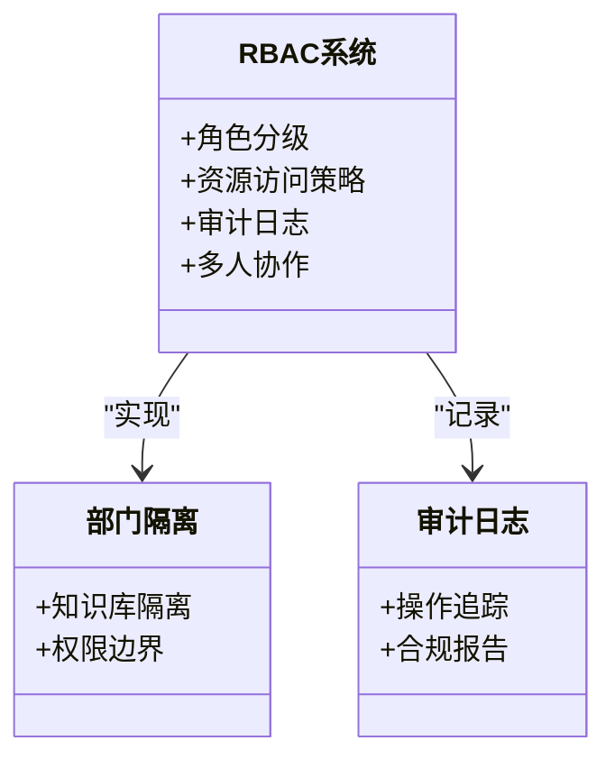
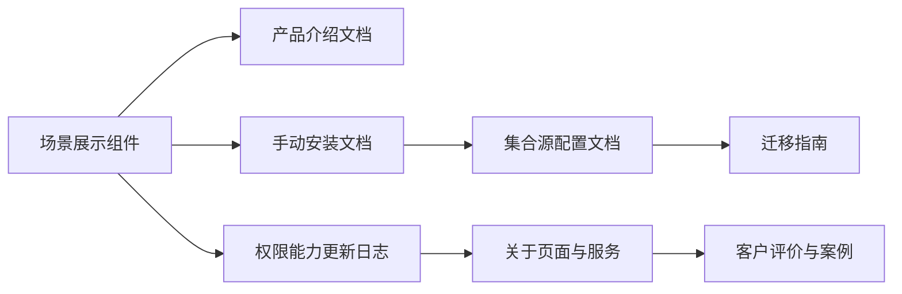

# 行业场景解决方案

<cite>
**本文引用的文件**
- [components/landing/ScenarioSection.vue](file://components/landing/ScenarioSection.vue)
- [content/docs/introduction/1.start.md](file://content/docs/introduction/1.start.md)
- [content/docs/introduction/11.manual-installation.md](file://content/docs/introduction/11.manual-installation.md)
- [content/docs/introduction/demo.md](file://content/docs/introduction/demo.md)
- [content/docs/framework/sources.md](file://content/docs/framework/sources.md)
- [content/docs/introduction/10.migration.md](file://content/docs/introduction/10.migration.md)
- [content/update/2503.md](file://content/update/2503.md)
- [pages/about.vue](file://pages/about.vue)
- [pages/buidai.vue](file://pages/buidai.vue)
- [utils/scene.ts](file://utils/scene.ts)
</cite>

## 目录
1. [引言](#引言)
2. [项目结构](#项目结构)
3. [核心组件](#核心组件)
4. [架构总览](#架构总览)
5. [详细组件分析](#详细组件分析)
6. [依赖关系分析](#依赖关系分析)
7. [性能考虑](#性能考虑)
8. [故障排查指南](#故障排查指南)
9. [结论](#结论)
10. [附录](#附录)

## 引言
本文件围绕buidai平台在不同行业的应用解决方案展开，基于页面中展示的三大场景进行扩展，重点覆盖：
- 全开源私有化部署方案：企业数据安全策略、自定义UI配置、高可用架构部署
- Dify与扣子工作流导入的技术实现路径与兼容性保障
- 企业级组织管理模块的权限模型设计：角色分级、部门隔离、审计日志
- 教育、电商、金融等行业的落地最佳实践与成功案例

## 项目结构
仓库采用Nuxt内容驱动的前端结构，文档与页面内容通过Nuxt Content进行组织与渲染。关键位置如下：
- 场景展示组件：components/landing/ScenarioSection.vue
- 场景化应用列表：utils/scene.ts
- 官方文档：content/docs/introduction/*.md、content/docs/framework/*.md
- 产品介绍与能力说明：content/docs/introduction/1.start.md
- 演示与访问信息：content/docs/introduction/demo.md
- 手动安装与环境变量：content/docs/introduction/11.manual-installation.md
- 集合源配置与迁移指南：content/docs/framework/sources.md、content/docs/introduction/10.migration.md
- 更新日志与权限能力：content/update/2503.md
- 关于页面与客户案例：pages/about.vue、pages/buidai.vue

图表来源
- [components/landing/ScenarioSection.vue](file://components/landing/ScenarioSection.vue#L1-L70)
- [utils/scene.ts](file://utils/scene.ts#L1-L122)
- [content/docs/introduction/1.start.md](file://content/docs/introduction/1.start.md#L1-L117)
- [content/docs/introduction/demo.md](file://content/docs/introduction/demo.md#L1-L33)
- [content/docs/introduction/11.manual-installation.md](file://content/docs/introduction/11.manual-installation.md#L1-L237)
- [content/docs/framework/sources.md](file://content/docs/framework/sources.md#L1-L129)
- [content/docs/introduction/10.migration.md](file://content/docs/introduction/10.migration.md#L1-L176)
- [content/update/2503.md](file://content/update/2503.md#L1-L15)
- [pages/about.vue](file://pages/about.vue#L1-L251)
- [pages/buidai.vue](file://pages/buidai.vue#L1026-L1062)

章节来源
- [components/landing/ScenarioSection.vue](file://components/landing/ScenarioSection.vue#L1-L70)
- [content/docs/introduction/1.start.md](file://content/docs/introduction/1.start.md#L1-L117)
- [content/docs/introduction/11.manual-installation.md](file://content/docs/introduction/11.manual-installation.md#L1-L237)
- [content/docs/framework/sources.md](file://content/docs/framework/sources.md#L1-L129)
- [content/docs/introduction/10.migration.md](file://content/docs/introduction/10.migration.md#L1-L176)
- [content/update/2503.md](file://content/update/2503.md#L1-L15)
- [pages/about.vue](file://pages/about.vue#L1-L251)
- [pages/buidai.vue](file://pages/buidai.vue#L1026-L1062)
- [utils/scene.ts](file://utils/scene.ts#L1-L122)

## 核心组件
- 场景展示组件：展示三大场景（全开源与DIY装修、导入Dify/扣子工作流、企业级组织管理模块），并提供图片与描述，体现平台在私有化部署、工作流导入与组织权限方面的优势。
- 场景化应用列表：提供多行业应用示例，便于理解平台在电商、教育、内容创作等领域的适配能力。

章节来源
- [components/landing/ScenarioSection.vue](file://components/landing/ScenarioSection.vue#L1-L70)
- [utils/scene.ts](file://utils/scene.ts#L1-L122)

## 架构总览
下图概述了平台在行业场景中的整体能力与部署形态，包括私有化部署、工作流导入、组织权限与应用市场等关键要素。

图表来源
- [components/landing/ScenarioSection.vue](file://components/landing/ScenarioSection.vue#L1-L70)
- [utils/scene.ts](file://utils/scene.ts#L1-L122)
- [content/docs/introduction/1.start.md](file://content/docs/introduction/1.start.md#L1-L117)
- [content/docs/introduction/demo.md](file://content/docs/introduction/demo.md#L1-L33)
- [content/docs/introduction/11.manual-installation.md](file://content/docs/introduction/11.manual-installation.md#L1-L237)
- [content/docs/framework/sources.md](file://content/docs/framework/sources.md#L1-L129)
- [content/docs/introduction/10.migration.md](file://content/docs/introduction/10.migration.md#L1-L176)
- [content/update/2503.md](file://content/update/2503.md#L1-L15)
- [pages/about.vue](file://pages/about.vue#L1-L251)
- [pages/buidai.vue](file://pages/buidai.vue#L1026-L1062)

## 详细组件分析

### 场景一：全开源与DIY装修（私有化部署与自定义UI）
- 私有化部署要点
  - 依赖要求与环境准备：NodeJS、PostgreSQL、Redis版本要求明确，便于企业按需采购与部署。
  - 环境变量配置：涵盖服务端口、CORS、JWT、数据库、Redis、缓存、日志、前端API前缀等，支持生产与演示环境区分。
  - 一键启动与分包启动：支持整体启动与后端/前端分别启动，便于开发与运维。
  - 访问地址与演示：提供本地访问地址与演示站点信息，便于快速验证。
- 数据安全策略
  - 开源与私有化部署优先，强调数据隐私与可控性，适合对数据安全敏感的企业。
- 自定义UI配置
  - 场景组件支持自定义首页、登录界面、加载动画Logo，便于企业品牌化与界面定制。
- 高可用架构部署
  - PM2配置项支持实例数量、执行模式、内存限制、日志日期格式、自动重启等，便于集群化与稳定性保障。
  - Docker相关参数（容器后缀、内存/CPU限制、内存保留）可用于容器化部署与资源约束。

图表来源
- [content/docs/introduction/11.manual-installation.md](file://content/docs/introduction/11.manual-installation.md#L1-L237)
- [content/docs/introduction/demo.md](file://content/docs/introduction/demo.md#L1-L33)
- [components/landing/ScenarioSection.vue](file://components/landing/ScenarioSection.vue#L1-L70)

章节来源
- [content/docs/introduction/11.manual-installation.md](file://content/docs/introduction/11.manual-installation.md#L1-L237)
- [content/docs/introduction/demo.md](file://content/docs/introduction/demo.md#L1-L33)
- [components/landing/ScenarioSection.vue](file://components/landing/ScenarioSection.vue#L1-L70)

### 场景二：导入Dify与扣子工作流（技术实现路径与兼容性保障）
- 技术实现路径
  - 平台支持导入Dify、扣子（Coze）等第三方工作流，打破平台局限，实现能力扩展与复用。
  - 通过集合源配置与内容迁移指南，确保工作流导入过程的稳定与可追溯。
- 兼容性保障
  - 集合源支持Git仓库、认证令牌与基本认证，便于私有仓库与跨团队协作。
  - 迁移指南明确了API变化与组件调整，有助于在版本升级中保持导入流程的连续性。

图表来源
- [components/landing/ScenarioSection.vue](file://components/landing/ScenarioSection.vue#L1-L70)
- [content/docs/framework/sources.md](file://content/docs/framework/sources.md#L1-L129)
- [content/docs/introduction/10.migration.md](file://content/docs/introduction/10.migration.md#L1-L176)

章节来源
- [components/landing/ScenarioSection.vue](file://components/landing/ScenarioSection.vue#L1-L70)
- [content/docs/framework/sources.md](file://content/docs/framework/sources.md#L1-L129)
- [content/docs/introduction/10.migration.md](file://content/docs/introduction/10.migration.md#L1-L176)

### 场景三：企业级组织管理模块（权限模型设计）
- 权限模型设计
  - 新增RBAC权限控制系统，支持细粒度资源访问策略，优化团队协作流程，支持多人实时编辑同一应用。
- 角色分级与部门隔离
  - 通过RBAC实现角色分级与资源访问控制，结合部门级知识库隔离配置，满足不同业务单元的数据隔离需求。
- 审计日志
  - 提供多级权限审计能力，确保操作可追溯，降低合规与风险管控成本。
- 成功案例
  - 客户评价中体现RBAC权限体系复用企业AD组策略、部门级知识库隔离配置效率显著提升，以及RAG知识库在政策准确性方面的积极作用。

图表来源
- [content/update/2503.md](file://content/update/2503.md#L1-L15)
- [pages/buidai.vue](file://pages/buidai.vue#L1026-L1062)

章节来源
- [content/update/2503.md](file://content/update/2503.md#L1-L15)
- [pages/buidai.vue](file://pages/buidai.vue#L1026-L1062)

### 行业最佳实践与成功案例

#### 教育行业
- 场景适配
  - 人工智能教育：部署开源平台，获得完整项目代码，便于教学演示与二次开发。
  - AI知识博主：打造私域流量平台，结合会员订阅服务实现持续收益。
- 实施建议
  - 使用私有化部署保障教学数据安全
  - 通过应用市场快速引入教学场景应用
  - 利用RBAC实现教师、学生、教务等角色分级与权限隔离

章节来源
- [content/docs/introduction/1.start.md](file://content/docs/introduction/1.start.md#L69-L88)

#### 电商行业
- 场景适配
  - 电商设计：批量生成商品主图、视频、换装等素材，提升视觉营销效率。
  - 信息流投放：快速生成组图、视频，满足多样化内容需求。
- 实施建议
  - 通过工作流导入与应用市场组合，构建电商专属AI美工能力
  - 利用RBAC实现运营、设计、供应链等多部门权限隔离
  - 结合私有化部署保护品牌素材与用户数据

章节来源
- [content/docs/introduction/1.start.md](file://content/docs/introduction/1.start.md#L81-L96)
- [utils/scene.ts](file://utils/scene.ts#L1-L122)

#### 金融行业
- 场景适配
  - 客户服务与营销：7×24小时智能客服，支持多轮对话与个性化推荐。
  - 智慧政务与公共服务：政策咨询、办事指南等智能服务入口。
- 实施建议
  - 采用私有化部署满足监管与数据安全要求
  - 通过RBAC实现风控、合规、运营等多层级权限控制
  - 利用审计日志满足合规与风控审计需求

章节来源
- [content/docs/introduction/1.start.md](file://content/docs/introduction/1.start.md#L73-L80)
- [pages/buidai.vue](file://pages/buidai.vue#L1026-L1062)

## 依赖关系分析
- 组件与文档耦合
  - 场景展示组件与产品介绍文档紧密关联，共同呈现平台能力与部署优势。
  - 场景化应用列表与产品介绍文档相互印证，体现平台在多行业的适配能力。
- 部署与配置耦合
  - 手动安装文档与集合源配置文档共同构成部署与内容导入的完整链路。
  - 迁移指南与集合源配置文档共同保障版本演进中的内容导入稳定性。
- 权限与服务耦合
  - 权限能力更新日志与关于页面、客户评价形成闭环，展示RBAC在企业中的落地成效。

图表来源
- [components/landing/ScenarioSection.vue](file://components/landing/ScenarioSection.vue#L1-L70)
- [content/docs/introduction/1.start.md](file://content/docs/introduction/1.start.md#L1-L117)
- [content/docs/introduction/11.manual-installation.md](file://content/docs/introduction/11.manual-installation.md#L1-L237)
- [content/docs/framework/sources.md](file://content/docs/framework/sources.md#L1-L129)
- [content/docs/introduction/10.migration.md](file://content/docs/introduction/10.migration.md#L1-L176)
- [content/update/2503.md](file://content/update/2503.md#L1-L15)
- [pages/about.vue](file://pages/about.vue#L1-L251)
- [pages/buidai.vue](file://pages/buidai.vue#L1026-L1062)

章节来源
- [components/landing/ScenarioSection.vue](file://components/landing/ScenarioSection.vue#L1-L70)
- [content/docs/introduction/1.start.md](file://content/docs/introduction/1.start.md#L1-L117)
- [content/docs/introduction/11.manual-installation.md](file://content/docs/introduction/11.manual-installation.md#L1-L237)
- [content/docs/framework/sources.md](file://content/docs/framework/sources.md#L1-L129)
- [content/docs/introduction/10.migration.md](file://content/docs/introduction/10.migration.md#L1-L176)
- [content/update/2503.md](file://content/update/2503.md#L1-L15)
- [pages/about.vue](file://pages/about.vue#L1-L251)
- [pages/buidai.vue](file://pages/buidai.vue#L1026-L1062)

## 性能考虑
- 私有化部署与资源规划
  - 依据环境变量与PM2配置，合理设置实例数量、内存限制与日志策略，平衡性能与成本。
- 工作流导入与内容同步
  - 使用集合源的include/exclude与prefix配置，优化内容导入范围与路径前缀，减少不必要的同步开销。
- 缓存与数据库
  - 合理设置缓存TTL与最大项数，结合数据库日志与清理间隔，提升系统响应与稳定性。

## 故障排查指南
- 演示环境注意事项
  - 演示站点每日自动还原数据，仅用于界面功能演示，避免保存隐私信息。
- 访问与兼容性
  - 若界面图标未显示，尝试刷新页面或更换浏览器（推荐Chrome）。
- 部署验证
  - 通过命令行验证NodeJS、npm、PostgreSQL、Redis版本，确保环境满足要求。
- 集合源与迁移
  - 私有仓库需使用认证令牌或基本认证，避免在代码中直接提交凭据。
  - 版本迁移后检查API与组件变更，确保导入流程与内容渲染正常。

章节来源
- [content/docs/introduction/demo.md](file://content/docs/introduction/demo.md#L1-L33)
- [content/docs/introduction/11.manual-installation.md](file://content/docs/introduction/11.manual-installation.md#L24-L42)
- [content/docs/framework/sources.md](file://content/docs/framework/sources.md#L105-L129)
- [content/docs/introduction/10.migration.md](file://content/docs/introduction/10.migration.md#L1-L176)

## 结论
buidai平台通过全开源与私有化部署、工作流导入与兼容性保障、企业级RBAC权限体系与审计日志，为企业在教育、电商、金融等行业的智能化转型提供了可落地的解决方案。结合场景化应用与成功案例，平台能够在保障数据安全与合规的前提下，快速构建与扩展AI能力，实现业务价值最大化。

## 附录
- 场景化应用清单参考：utils/scene.ts
- 产品能力与场景说明：content/docs/introduction/1.start.md
- 私有化部署与环境变量：content/docs/introduction/11.manual-installation.md
- 演示与访问信息：content/docs/introduction/demo.md
- 集合源与迁移：content/docs/framework/sources.md、content/docs/introduction/10.migration.md
- 权限能力更新：content/update/2503.md
- 关于页面与服务：pages/about.vue
- 客户评价与案例：pages/buidai.vue