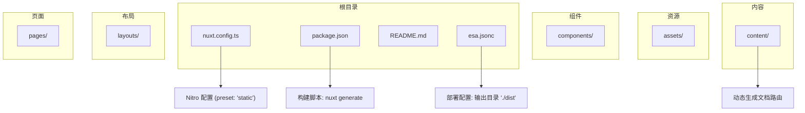
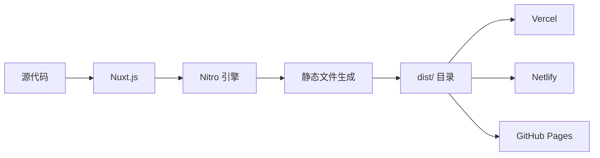
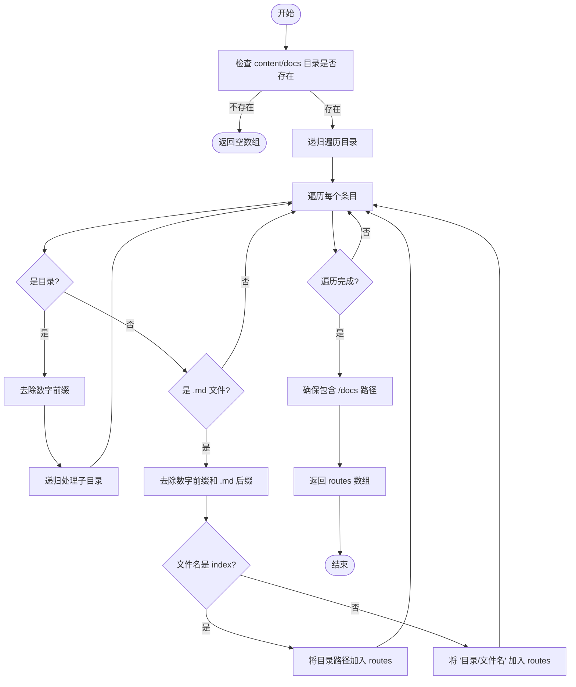
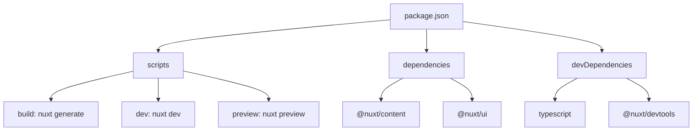

# 部署指南

<cite>
**本文档中引用的文件**  
- [nuxt.config.ts](file://nuxt.config.ts)
- [package.json](file://package.json)
- [README.md](file://README.md)
- [utils/getDocsRoutes.ts](file://utils/getDocsRoutes.ts)
- [esa.jsonc](file://esa.jsonc)
- [content.config.ts](file://content.config.ts)
</cite>

## 目录
1. [简介](#简介)
2. [项目结构](#项目结构)
3. [核心组件](#核心组件)
4. [架构概述](#架构概述)
5. [详细组件分析](#详细组件分析)
6. [依赖分析](#依赖分析)
7. [性能考虑](#性能考虑)
8. [故障排除指南](#故障排除指南)
9. [结论](#结论)

## 简介
本文档旨在为基于 Nuxt.js 的“必定AI”项目提供一份详尽的生产环境部署指南。该指南将详细说明如何通过 `npm run build` 命令生成完全静态的网站文件，并解释输出目录（dist）的结构和内容。此外，文档将指导用户如何将生成的静态文件部署到主流的静态网站托管服务（如 Vercel、Netlify、GitHub Pages），并解决部署过程中可能遇到的常见问题，例如路由 404 错误和静态资源路径问题。最后，文档将提供在不同平台上的具体部署配置示例，并建议部署后的性能优化措施。

## 项目结构
本项目采用模块化设计，主要目录包括 `assets`（存放静态资源和全局样式）、`components`（存放可复用的 Vue 组件）、`content`（存放 Markdown 格式的内容数据源，如博客和文档）、`layouts`（存放页面布局）、`pages`（存放路由页面）等。项目根目录下包含核心配置文件，如 `nuxt.config.ts`、`package.json` 和 `README.md`。

**Diagram sources**
- [nuxt.config.ts](file://nuxt.config.ts#L40-L51)
- [package.json](file://package.json#L7)
- [esa.jsonc](file://esa.jsonc#L5)

**Section sources**
- [nuxt.config.ts](file://nuxt.config.ts#L1-L91)
- [package.json](file://package.json#L1-L48)
- [README.md](file://README.md#L1-L117)

## 核心组件
项目的核心组件包括 `nuxt.config.ts` 中的 Nitro 配置，该配置指定了 `preset: 'static'`，确保项目被构建为完全静态的网站。`package.json` 文件中的 `build` 脚本定义了构建命令为 `nuxt generate`，这是生成静态文件的关键。`utils/getDocsRoutes.ts` 文件负责遍历 `content/docs` 目录，动态生成所有文档页面的路由列表，以确保这些页面在构建时被正确预渲染。

**Section sources**
- [nuxt.config.ts](file://nuxt.config.ts#L40-L51)
- [package.json](file://package.json#L7)
- [utils/getDocsRoutes.ts](file://utils/getDocsRoutes.ts#L1-L58)

## 架构概述
本项目采用 Nuxt.js 的静态站点生成（SSG）模式，利用 Nitro 引擎的 `static` 预设，将整个应用预渲染为静态 HTML、CSS 和 JavaScript 文件。这种架构非常适合内容驱动的网站，如文档中心和博客，因为它提供了极佳的加载性能和 SEO 友好性。

**Diagram sources**
- [nuxt.config.ts](file://nuxt.config.ts#L40-L45)
- [package.json](file://package.json#L7)

## 详细组件分析

### 构建与输出分析
`nuxt.config.ts` 文件中的 `nitro` 配置块是生成静态文件的核心。`preset: 'static'` 明确指示构建系统生成一个通用的静态网站，而 `output.publicDir: 'dist'` 则强制将输出目录设置为 `dist`，这与 Vercel 等平台的默认配置相兼容。`prerender.routes` 通过调用 `getDocsRoutes()` 函数，动态注入所有文档页面的路由，确保它们被预渲染。

#### 预渲染路由生成

**Diagram sources**
- [utils/getDocsRoutes.ts](file://utils/getDocsRoutes.ts#L17-L57)

**Section sources**
- [utils/getDocsRoutes.ts](file://utils/getDocsRoutes.ts#L1-L58)
- [nuxt.config.ts](file://nuxt.config.ts#L49)

### 部署配置分析
`esa.jsonc` 文件是为特定部署平台（可能是 Vercel 或类似平台）准备的配置文件。它指定了项目的安装命令为 `npm install`，并明确指出静态资源的目录为 `./dist`。`notFoundStrategy` 设置为 `404Page`，这表明平台应使用 SPA fallback 策略来处理未找到的路由，这对于基于 Vue Router 的单页应用（SPA）至关重要，可以防止用户访问深层链接时出现 404 错误。

**Section sources**
- [esa.jsonc](file://esa.jsonc#L1-L8)

## 依赖分析
项目依赖主要分为开发依赖和生产依赖。开发依赖包括 `@nuxt/devtools`、`typescript` 等，用于开发和调试。生产依赖则包括 `@nuxt/content`、`@nuxt/ui` 等核心模块，它们是应用运行所必需的。`package.json` 文件中的 `scripts` 部分定义了 `build`、`dev`、`preview` 等关键命令，构成了项目的构建和部署流水线。

**Diagram sources**
- [package.json](file://package.json#L6-L11)
- [package.json](file://package.json#L36-L46)

**Section sources**
- [package.json](file://package.json#L1-L48)

## 性能考虑
由于项目被构建为完全静态的网站，其性能表现优异。所有页面在构建时就已经生成，用户访问时无需服务器端渲染，加载速度极快。为了进一步优化性能，建议在部署后启用 CDN 加速，将静态资源分发到全球边缘节点。同时，确保托管服务启用了 Gzip 或 Brotli 压缩，以减小文件传输大小。`nuxt.config.ts` 中禁用构建时类型检查（`typescript.typeCheck: false`）也是为了提升构建速度。

## 故障排除指南
部署过程中最常见的问题是路由 404 错误。这通常是由于托管平台未正确配置 SPA fallback 所致。解决方案是确保平台的配置文件（如 `esa.jsonc` 中的 `notFoundStrategy: '404Page'`）或平台设置中启用了将所有未匹配的路由重定向到 `index.html` 的功能。另一个潜在问题是静态资源路径错误，这可能源于 `nuxt.config.ts` 中的 `app.head.link` 配置。应确保所有资源路径（如 CSS、字体）都使用相对路径或绝对路径，避免因部署路径变化而导致资源加载失败。

**Section sources**
- [esa.jsonc](file://esa.jsonc#L6)
- [nuxt.config.ts](file://nuxt.config.ts#L74-L84)

## 结论
通过遵循本指南，开发者可以成功地将“必定AI”项目构建并部署为一个高性能的静态网站。关键步骤包括理解 `nuxt.config.ts` 中的 `nitro.preset` 配置、利用 `getDocsRoutes` 动态生成预渲染路由、以及正确配置托管平台以处理 SPA 路由。通过这些实践，可以确保网站在生产环境中稳定、高效地运行。