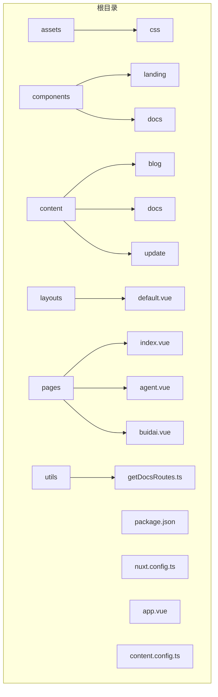
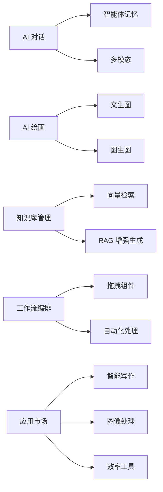
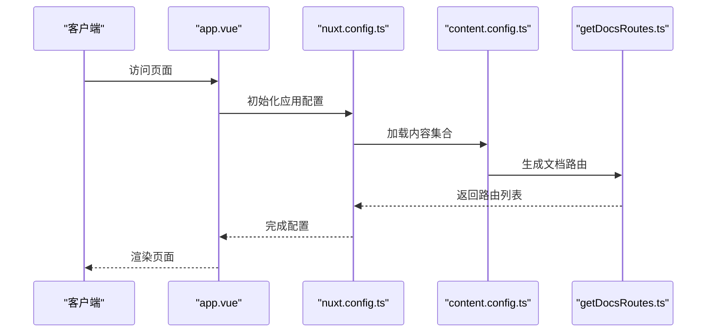
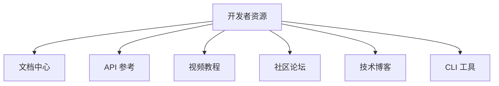

# 项目概述

<cite>
**本文档引用的文件**
- [package.json](file://package.json)
- [nuxt.config.ts](file://nuxt.config.ts)
- [app.vue](file://app.vue)
- [content.config.ts](file://content.config.ts)
- [README.md](file://README.md)
- [pages/index.vue](file://pages/index.vue)
- [pages/agent.vue](file://pages/agent.vue)
- [pages/buidai.vue](file://pages/buidai.vue)
- [pages/demo.vue](file://pages/demo.vue)
- [pages/plugin.vue](file://pages/plugin.vue)
- [pages/resources.vue](file://pages/resources.vue)
- [components/AppNavigation.vue](file://components/AppNavigation.vue)
- [components/landing/HeroSection.vue](file://components/landing/HeroSection.vue)
- [components/landing/ProductFeatures.vue](file://components/landing/ProductFeatures.vue)
- [utils/getDocsRoutes.ts](file://utils/getDocsRoutes.ts)
</cite>

## 目录

1. [引言](#引言)
2. [项目结构](#项目结构)
3. [核心功能模块](#核心功能模块)
4. [技术架构与实现](#技术架构与实现)
5. [应用与部署](#应用与部署)
6. [开发者资源](#开发者资源)
7. [结论](#结论)

## 引言

必创AI（BuidAI）是一个基于 Nuxt 4 构建的企业级 AI 智能体搭建平台。该项目旨在为 AI 开发者、创业者和企业团队提供一个现代化、内容驱动且高度组件化的开发环境，以加速 AI 应用的开发与部署。平台集成了 AI 对话、AI 绘画、AI 视频生成、知识库管理、工作流编排等前沿功能，通过其强大的前端架构和丰富的功能模块，显著提升了开发者生产力和 AI 应用的快速开发能力。

**Section sources**
- [README.md](file://README.md#L1-L117)

## 项目结构

必创AI项目采用清晰的模块化目录结构，便于维护和扩展。主要目录包括 `assets`（静态资源）、`components`（可复用的 Vue 组件）、`content`（Markdown 内容源）、`layouts`（页面布局）、`pages`（路由页面）和 `utils`（工具函数）。这种结构支持内容驱动的开发模式，同时确保了代码的高内聚和低耦合。

**Diagram sources **
- [project_structure](#project_structure)
- [README.md](file://README.md#L15-L45)

**Section sources**
- [README.md](file://README.md#L13-L45)

## 核心功能模块

必创AI平台提供了全面的功能模块，涵盖了 AI 应用开发的各个方面。这些功能通过 `pages` 和 `components` 协同工作，为用户提供了一站式的解决方案。

### AI 对话与智能体

平台支持基于大语言模型（LLM）的 AI 对话，用户可以与智能体进行多轮对话、文本生成和意图识别。智能体具备记忆、目标和工具使用能力，能够自主执行复杂任务。

### AI 绘画与视频生成

必创AI集成了文生图、图生图于一体的创意绘画平台，支持 AI 绘画和 AI 视频生成。用户可以通过简单的指令生成高质量的图像和视频内容，释放无限创意可能。

### 知识库管理

通过文档构建知识库，支持向量检索与 RAG（检索增强生成）增强生成。用户可以上传 PDF、Word、Markdown 等多格式文档，AI 会基于私有数据进行精准回答，无需重新训练模型。

### 工作流编排

强大的可视化 Workflow 编排引擎，通过拖拽即可将大模型、插件、知识库等组件连接起来，构建复杂的业务流程，实现从简单对话到复杂任务的自动化处理。

### 应用市场

必创AI应用市场提供了丰富的 AI 插件与独立应用，涵盖智能写作、图像处理、效率工具等多个领域。用户可以一键扩展其 AI 办公能力，满足多样化需求。

**Diagram sources **
- [pages/agent.vue](file://pages/agent.vue#L720-L763)
- [pages/plugin.vue](file://pages/plugin.vue#L179-L194)

**Section sources**
- [pages/agent.vue](file://pages/agent.vue#L720-L763)
- [pages/plugin.vue](file://pages/plugin.vue#L179-L194)

## 技术架构与实现

必创AI项目基于 Nuxt 4 构建，采用了现代化的前端架构，确保了高性能和良好的开发体验。

### Nuxt 应用启动流程

Nuxt 应用的启动流程由 `nuxt.config.ts` 文件中的模块配置驱动。项目启用了 `@nuxt/ui` 和 `@nuxt/content` 模块，前者提供了基于 Tailwind CSS 的 UI 组件库，后者支持内容驱动的 Markdown 文档管理。`app.vue` 文件作为应用的根模板，定义了全局布局和页面渲染逻辑。

### 全局配置

`nuxt.config.ts` 文件中定义了应用的全局配置，包括 SEO 元数据、CSS 文件、Nitro 服务端引擎配置等。`app.config.ts` 文件则用于配置 Nuxt UI 的全局设置，如主题和图标。

### 内容驱动设计

`content.config.ts` 文件定义了内容集合（如博客、文档、更新日志），并通过 `getDocsRoutes.ts` 工具函数自动生成文档路由，实现了内容的动态管理和预渲染。

**Diagram sources **
- [nuxt.config.ts](file://nuxt.config.ts#L4-L91)
- [app.vue](file://app.vue#L1-L12)
- [content.config.ts](file://content.config.ts#L1-L57)
- [utils/getDocsRoutes.ts](file://utils/getDocsRoutes.ts#L1-L58)

**Section sources**
- [nuxt.config.ts](file://nuxt.config.ts#L4-L91)
- [app.vue](file://app.vue#L1-L12)
- [content.config.ts](file://content.config.ts#L1-L57)
- [utils/getDocsRoutes.ts](file://utils/getDocsRoutes.ts#L1-L58)

## 应用与部署

必创AI平台支持多种部署方式，包括静态预渲染和私有化部署。通过 `package.json` 中的脚本命令，用户可以轻松地构建和预览生产环境的应用。平台还提供了详细的文档和示例，帮助用户快速上手和部署。

**Section sources**
- [package.json](file://package.json#L6-L11)
- [README.md](file://README.md#L47-L55)

## 开发者资源

必创AI为开发者提供了丰富的资源，包括文档中心、API 参考、视频教程、社区论坛和技术博客。这些资源帮助开发者快速掌握平台的使用方法，解决技术难题，并分享最佳实践。

**Diagram sources **
- [pages/resources.vue](file://pages/resources.vue#L93-L130)

**Section sources**
- [pages/resources.vue](file://pages/resources.vue#L93-L130)

## 结论

必创AI作为一个企业级 AI 智能体搭建平台，凭借其现代化的前端架构、内容驱动的设计理念和丰富的功能模块，为 AI 开发者、创业者和企业团队提供了一个强大的开发环境。通过 Nuxt 4 的支持，项目实现了高效的开发流程和卓越的用户体验，助力用户在智能时代保持领先。
